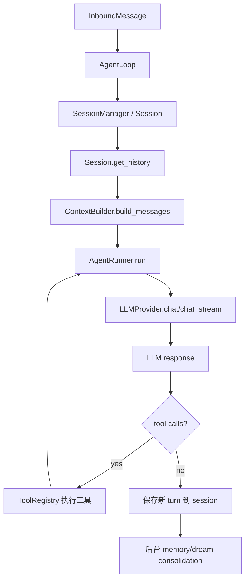
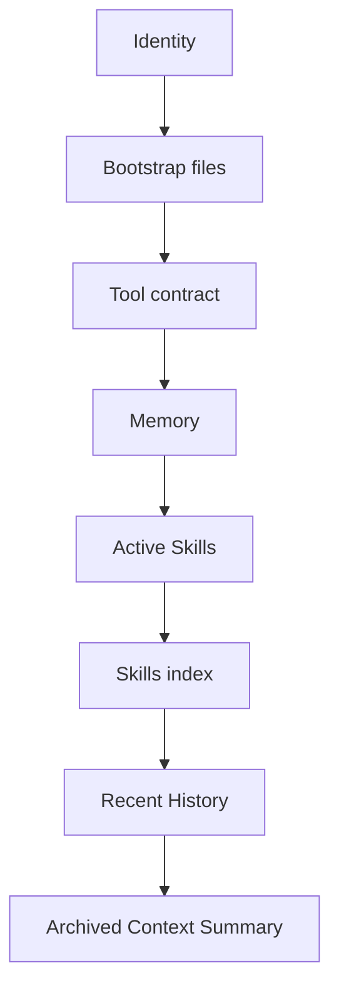
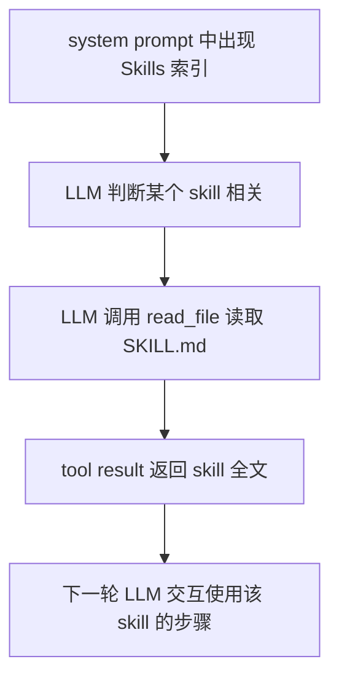

# Nanobot 上下文、提示词组装与 Skill 加载机制分析

本文整理了针对 nanobot 对话链路的三轮分析内容：

1. nanobot 的上下文管理机制。
2. 每次与 LLM 交互时，提示词和消息列表的组装逻辑。
3. skill 在该过程中的发现、注入、按需读取和维护方式。

分析基于当前仓库源码，重点文件包括：

- `nanobot/nanobot/agent/loop.py`
- `nanobot/nanobot/agent/context.py`
- `nanobot/nanobot/session/manager.py`
- `nanobot/nanobot/agent/runner.py`
- `nanobot/nanobot/agent/skills.py`
- `nanobot/nanobot/agent/tools/filesystem.py`
- `nanobot/nanobot/agent/subagent.py`
- `nanobot/nanobot/providers/*`

## 一、整体链路

nanobot 每次处理用户消息时，大致会经历下面这条链：



这里有一个核心分层：

- `AgentLoop` 负责产品层调度：会话、锁、运行状态、工具上下文、保存结果、后台整理。
- `SessionManager` 负责持久化和回放历史。
- `ContextBuilder` 负责构造 OpenAI-style 的 `messages`。
- `AgentRunner` 负责真正的 tool-using LLM loop，并在每次请求前做上下文治理。
- `LLMProvider` 负责把 OpenAI-style 消息转换为具体 provider 的 wire format。

## 二、上下文管理机制

### 1. 会话是上下文的持久根

`Session` 定义在 `nanobot/nanobot/session/manager.py`。每个 session 包含：

- `key`：会话键，通常来自 channel/chat id，或 unified session 的统一键。
- `messages`：历史消息数组。
- `metadata`：会话元数据，例如 runtime checkpoint、goal state、CLI app/MCP attachment 信息等。
- `last_consolidated`：已经被整理进长期记忆的消息偏移。

`SessionManager.save()` 会把 session 保存成 JSONL：

1. 第一行是 metadata。
2. 后续每行是一条 message。

这使 session 文件既可以流式追加/恢复，也方便出现坏行时做局部修复。

### 2. 历史回放不是直接拿全量 messages

每次组装 LLM 输入前，`AgentLoop` 会从 session 中取历史：

```python
history = session.get_history(
    max_messages=self._max_messages,
    max_tokens=self._replay_token_budget(),
    include_timestamps=True,
)
```

`Session.get_history()` 做了多层裁剪和清洗：

- 只回放 `last_consolidated` 之后的未整理消息。
- 先按 `max_messages` 从尾部截取。
- 尽量从用户消息开始，避免模型看到 assistant-only 的残缺上下文。
- 用 `find_legal_message_start()` 避免开头落在孤立 tool result 上。
- 跳过 `_command` 消息，避免命令型消息污染对话上下文。
- 清洗 assistant replay text，去掉一些可能被模型模仿的内部元数据。
- 对用户消息可加入 `[Message Time: ...]`，帮助相对日期推理。
- 对历史中的图片、CLI app、MCP preset 生成 breadcrumb，保留“发生过这件事”的线索。
- 若设置了 token budget，再从尾部按 token 估算保留合法后缀。

所以 nanobot 的上下文不是“session 文件原样塞进 prompt”，而是一个受约束的、尽量合法的回放窗口。

### 3. Runtime context 不持久污染历史

`ContextBuilder.build_messages()` 会把当前用户消息和 runtime context 合并到同一条 user message 中。runtime context 包含 channel/chat/timezone/sender 等信息，也可能包含 goal state、CLI app、MCP 等当前 turn 的元数据。

关键设计是：runtime context 被附加在用户内容后面，并带有明确标记：

```text
[Runtime Context — metadata only, not instructions]
...
[/Runtime Context]
```

保存 turn 时，`AgentLoop._save_turn()` 会把这个 runtime context block 从 user message 中剥离掉，再写入 session。这避免每次动态状态被永久写入历史，造成后续 prompt 越来越脏。

### 4. Runner 在每次 provider 调用前再治理一次

`ContextBuilder` 只负责初始消息列表。真正发给 LLM 前，`AgentRunner.run()` 每一轮都会对 `messages_for_model` 做一次治理：

```python
messages_for_model = self._drop_orphan_tool_results(messages)
messages_for_model = self._backfill_missing_tool_results(messages_for_model)
messages_for_model = self._microcompact(messages_for_model)
messages_for_model = self._apply_tool_result_budget(spec, messages_for_model)
messages_for_model = self._snip_history(spec, messages_for_model)
messages_for_model = self._drop_orphan_tool_results(messages_for_model)
messages_for_model = self._backfill_missing_tool_results(messages_for_model)
```

这些治理不直接改持久化 session，只作用于“本次发给模型的消息”：

- `_drop_orphan_tool_results()` 删除没有对应 assistant tool call 的 tool result。
- `_backfill_missing_tool_results()` 给缺失的 tool result 补一个合成错误结果，避免 provider 因工具调用链不完整而拒绝。
- `_microcompact()` 把较旧、较大的 compactable tool result 替换成一行摘要。
- `_apply_tool_result_budget()` 对工具结果做截断或外置持久化。
- `_snip_history()` 根据 context window 和输出预算裁剪历史，保留 system 和最近合法上下文。

这说明 nanobot 有两层裁剪：

- Session 层：决定从持久历史中拿哪些消息。
- Runner 层：决定当前 provider 请求实际能看到哪些消息。

### 5. 工具循环会扩展同一个 turn 的上下文

如果 LLM 返回 tool calls，`AgentRunner` 会：

1. 把 assistant tool call message append 到当前 `messages`。
2. 执行工具。
3. 把每个 tool result 作为 `role="tool"` append。
4. 继续下一轮 LLM 请求。

因此一次用户 turn 内可能发生多次 LLM 交互。每次交互都会带上之前工具调用和工具结果，但在发送前仍会经过 Runner 的上下文治理。

### 6. 保存和长期整理

LLM turn 结束后，`AgentLoop._save_turn()` 只保存本轮新增消息，并做额外清洗：

- 跳过空 assistant message。
- 截断过大的 tool result。
- 去掉 user message 尾部的 runtime context block。
- 给消息补 timestamp。
- 给最后一条 assistant message 记录 latency。

随后：

- `session.enforce_file_cap()` 控制 session 文件最大消息数，超出的部分可以 raw archive。
- `consolidator.maybe_consolidate_by_tokens()` 后台触发 Dream/memory consolidation，把长期事实沉淀到 `SOUL.md`、`USER.md`、`memory/MEMORY.md` 或 `skills/<name>/SKILL.md`。

## 三、每次 LLM 交互的提示词组装逻辑

### 1. `ContextBuilder.build_messages()` 是 OpenAI-style messages 的入口

主要入口在 `nanobot/nanobot/agent/context.py`：

```python
messages = [
    {
        "role": "system",
        "content": self.build_system_prompt(...),
    },
    *history,
]
messages.append({"role": current_role, "content": merged})
```

这里生成的是中间格式，接近 OpenAI Chat Completions 的消息结构，并不一定是最终 provider 请求格式。

### 2. System prompt 的拼接顺序

`ContextBuilder.build_system_prompt()` 使用多个 section 拼出 system prompt，section 之间用：

```text
---
```

分隔。顺序如下：



具体内容：

1. Identity  
   来自 `_get_identity()`，包含 agent 身份、workspace、channel 等基础约束。

2. Bootstrap files  
   读取 workspace 下的 `AGENTS.md`、`SOUL.md`、`USER.md`。这几个文件是长期行为、人格、用户偏好的主要入口。

3. Tool contract  
   渲染 `nanobot/nanobot/templates/agent/tool_contract.md`，告诉模型工具调用协议和约束。

4. Memory  
   来自 `MemoryStore.get_memory_context()`，通常是长期项目事实或用户相关记忆。

5. Active Skills  
   全文注入 `always: true` 且可用的 skill。

6. Skills  
   注入普通 skill 的索引，不注入全文。

7. Recent History  
   从 memory history 中读取 Dream 尚未处理的最近事件，最多 50 条，最多 32,000 字符。

8. Archived Context Summary  
   如果当前 session 经过 auto compact，会把归档摘要作为 `[Archived Context Summary]` 注入。

### 3. 当前用户消息与 runtime context 合并

当前用户消息通过 `_build_user_content()` 生成：

- 纯文本消息保持字符串。
- 带图片/媒体时转成 content blocks。

然后 runtime context 被附加到用户消息后面：

```python
if isinstance(user_content, str):
    merged = f"{user_content}\n\n{runtime_ctx}"
else:
    merged = user_content + [{"type": "text", "text": runtime_ctx}]
```

这么做有两个目的：

- 避免连续 user messages 导致某些 provider 拒绝请求。
- 把经常变化的 runtime context 放在用户内容后面，保留前缀稳定性，有利于 prompt cache。

如果 history 最后一条消息和当前消息 role 相同，`build_messages()` 会合并内容，而不是追加一条同 role message。

### 4. Tool definitions 不在 messages 里

工具定义通过 `ToolRegistry.get_definitions()` 作为 provider 参数传入，不是 system prompt 的 markdown 内容。

`ToolRegistry.get_definitions()` 会做稳定排序：

- 内置工具在前。
- MCP 工具在后。
- 各自按 schema name 排序。

这也是 prompt cache 友好的设计：工具 schema 顺序稳定，减少无意义 cache miss。

### 5. Provider 发送前还有格式适配

`ContextBuilder` 输出的是通用消息格式。不同 provider 还会再次转换。

OpenAI Responses API：

- `openai_responses/converters.py` 会把 `role="system"` 抽成 `instructions`。
- 非 system 消息转换成 Responses API 的 `input` items。
- assistant tool calls 转成 `function_call`。
- tool result 转成 `function_call_output`。

Anthropic：

- `anthropic_provider.py` 会把 system message 抽成 `system` 参数。
- tool result 转成 Anthropic `tool_result` block，并放入 user turn。
- assistant tool calls 转成 `tool_use` block。
- 连续同 role message 会合并。
- Anthropic 不允许最后一条是 assistant prefill，也不允许第一条是 assistant，因此会做额外修复。

OpenAI-compatible：

- `openai_compat_provider.py` 会清洗非标准字段。
- 规范化 tool call id。
- 有些兼容网关不接受 assistant 同时带非空 content 和 tool_calls，因此会把 content 置空。
- 通过 `_enforce_role_alternation()` 合并连续同 role 消息，并移除尾部 assistant。

因此，“提示词组装”可以分成三层：

1. `ContextBuilder` 组装逻辑上下文。
2. `AgentRunner` 做上下文治理和裁剪。
3. `LLMProvider` 转换成 provider-specific wire format。

## 四、Skill 是如何在过程中被加载的

### 1. Skill loader 的两个来源

skill 机制集中在 `nanobot/nanobot/agent/skills.py` 的 `SkillsLoader`。

每个 skill 是一个目录：

```text
<skill-name>/
  SKILL.md
```

loader 会扫描两个位置：

1. Workspace skill  
   `<workspace>/skills/<skill-name>/SKILL.md`

2. Builtin skill  
   `nanobot/nanobot/skills/<skill-name>/SKILL.md`

扫描只看直接子目录，不递归。只有存在 `SKILL.md` 的目录才被视为 skill。

workspace skill 优先级高于 builtin skill。同名时，workspace 会 shadow builtin。

```python
skills = self._skill_entries_from_dir(self.workspace_skills, "workspace")
workspace_names = {entry["name"] for entry in skills}
skills.extend(
    self._skill_entries_from_dir(self.builtin_skills, "builtin", skip_names=workspace_names)
)
```

这让用户可以覆盖内置 skill，但也意味着同名覆盖需要谨慎。

### 2. Frontmatter 解析

`SKILL.md` 可以带 YAML frontmatter：

```markdown
---
name: github
description: "Interact with GitHub using the `gh` CLI."
metadata: {"nanobot":{"requires":{"bins":["gh"]}}}
---

# GitHub Skill
...
```

`SkillsLoader.get_skill_metadata()` 会解析 frontmatter。额外的 nanobot/openclaw metadata 通过 `_parse_nanobot_metadata()` 读取：

- `metadata.nanobot`
- `metadata.openclaw`

当前 loader 真正强制使用的 metadata 主要是：

- `requires.bins`
- `requires.env`
- `always`

其他如 `emoji`、`install`、`os` 目前不会被 loader 强制执行。

### 3. 可用性过滤

`list_skills(filter_unavailable=True)` 默认会过滤掉依赖不满足的 skill。

依赖检查只做两类：

- `requires.bins`：通过 `shutil.which(cmd)` 检查 CLI 是否存在。
- `requires.env`：通过 `os.environ.get(var)` 检查环境变量是否存在。

不过 `build_skills_summary()` 特意使用 `filter_unavailable=False`，所以不可用 skill 仍会出现在索引里，但会标注原因：

```text
- **github** — ... (unavailable: CLI: gh) `/path/to/SKILL.md`
```

这和模板里的提示一致：不可用 skill 可能需要先安装依赖。

### 4. disabled_skills

`disabled_skills` 来自配置：

```python
disabled_skills: list[str] = Field(default_factory=list)
```

它会传入：

- `ContextBuilder`
- `SkillsLoader`
- `SubagentManager`

被禁用的 skill 会同时从以下地方消失：

- `list_skills()`
- `build_skills_summary()`
- `get_always_skills()`

这意味着禁用一个 always skill 后，它也不会进入 `# Active Skills`。

### 5. always skill 会全文注入

`ContextBuilder.build_system_prompt()` 每次都会执行：

```python
always_skills = self.skills.get_always_skills()
if always_skills:
    always_content = self.skills.load_skills_for_context(always_skills)
    parts.append(f"# Active Skills\n\n{always_content}")
```

`load_skills_for_context()` 会读取 skill 全文，并去掉 YAML frontmatter：

```markdown
# Active Skills

### Skill: memory

# Memory
...

---

### Skill: my

# Self-Awareness
...
```

当前内置 always skill 的典型例子：

- `nanobot/nanobot/skills/memory/SKILL.md`
- `nanobot/nanobot/skills/my/SKILL.md`

这些 skill 是每次 LLM 请求都能直接看到的常驻能力说明。

### 6. 普通 skill 只进入索引

非 always skill 不会全文注入 system prompt。它们只出现在 `# Skills` section 中。

模板 `nanobot/nanobot/templates/agent/skills_section.md` 写得很直接：

```markdown
# Skills

The following skills extend your capabilities. To use a skill, read its SKILL.md file using the read_file tool.
Unavailable skills need dependencies installed first — you can try installing them with apt/brew.

{{ skills_summary }}
```

summary 行的格式是：

```markdown
- **skill-name** — description  `path/to/SKILL.md`
```

也就是说，普通 skill 的加载是渐进式的：



这和 tool 不同：

- tool 是 schema 层能力，provider 直接知道可以调用哪些函数。
- skill 是 prompt 层说明，模型需要读了 `SKILL.md` 才掌握具体流程。

### 7. `read_file` 为什么能读 builtin skill

普通 skill 的按需加载依赖 `read_file`。在文件工具创建时，builtin skills 目录被加进额外可读目录：

```python
from nanobot.agent.skills import BUILTIN_SKILLS_DIR
extra_read = [BUILTIN_SKILLS_DIR]
```

所以即便工具被限制在 workspace 内，`read_file` 仍能读内置 skill 的 `SKILL.md`。workspace skill 本来就在 workspace 内，也能被读取。

`ReadFileTool` 的 scope 包含：

```python
_scopes = {"core", "subagent", "memory"}
```

因此主 agent、subagent 和 memory/Dream 相关流程都可以读文件，只是各自 prompt 和可写范围不同。

### 8. `skill_names` 参数目前不是显式加载入口

`ContextBuilder.build_system_prompt()` 和 `build_messages()` 都有 `skill_names` 参数，但当前实现没有用它来选择性全文加载普通 skill。

实际行为是：

- always skill：自动全文注入。
- 普通 skill：进入索引，等待模型主动 `read_file`。

所以目前不存在“用户提到 github，就自动把 github/SKILL.md 全文塞进 system prompt”的机制。触发主要依赖：

- skill 的 `description` 是否清楚。
- `# Skills` 模板是否提示模型读取。
- 模型是否判断当前任务需要该 skill。

### 9. Subagent 的 skill 加载更轻

`SubagentManager._build_subagent_prompt()` 使用 `SkillsLoader(...).build_skills_summary()`，只给 subagent 一个 skills summary。

subagent 模板中写的是：

```markdown
## Skills

Read SKILL.md with read_file to use a skill.

{{ skills_summary }}
```

它没有像主 agent 那样注入 `# Active Skills` 全文。换句话说，subagent 默认更轻量，所有 skill 都倾向于按需读取。

### 10. CLI App 是旁路触发

CLI App 会在 runtime context 里加入类似：

```text
CLI App Attachment: @foo (installed; tool=run_cli_app; entry_point=...; skill=skills/cli-app-foo/SKILL.md).
Read the skill when useful, then run this app with `run_cli_app`; do not bypass it with shell.
```

这不是 `SkillsLoader` 自动全文注入，而是在当前 turn 的 runtime context 中给模型一个更强的局部提示。模型仍然需要在有用时读取对应 `SKILL.md`。

历史回放时，SessionManager 也会把 CLI App attachment 以 breadcrumb 形式恢复，避免模型完全忘记某个 CLI app 曾随用户消息进入上下文。

### 11. Dream 会创建和维护 skill

Dream/memory consolidation 不是主对话里的 skill 使用机制，但它会维护 skill 文件。

Dream prompt 明确要求：

- `SOUL.md`：agent 行为、交互风格、工具使用策略。
- `USER.md`：用户偏好。
- `MEMORY.md`：项目上下文和长期事实。
- `skills/<name>/SKILL.md`：可复用流程模板、具体步骤、命令、例子。

当历史中出现重复、可复用、足够具体的工作流时，Dream 可以创建或更新 workspace skill。

所以 skill 有两条生命线：

1. 对话时作为能力说明被发现、索引、按需读取。
2. 整理时由 Dream 从历史中沉淀和维护。

## 五、设计取舍与潜在问题

### 1. 上下文节省优先

普通 skill 不全文注入，能显著节省 system prompt token。只有 always skill 常驻，其他内容按需读取。

这适合 skill 数量较多的场景，但要求 skill description 写得足够好，否则模型可能不会主动读取。

### 2. Prompt cache 友好

系统提示词中较稳定的部分放在前面，runtime context 附在用户消息后面。Tool definitions 也做稳定排序。这些设计都有助于减少 cache miss。

### 3. 多层合法性修复

Session、Runner、Provider 都在修复消息序列合法性：

- Session 避免回放从孤立 tool result 开始。
- Runner 删除 orphan tool result、补 missing tool result、裁剪历史。
- Provider 合并同 role、移除尾部 assistant、规范化 tool id。

这说明 nanobot 面对的是多 provider、多工具、多轮中断恢复的复杂场景，不能只靠单点修复。

### 4. `skill_names` 参数是一个未完成的扩展点

代码里已经有 `skill_names` 参数，但尚未接入选择性全文加载。未来可以把它发展成：

- 命令显式加载：例如 `/skill github`。
- 规则触发加载：根据用户消息和 skill description 做检索。
- 上一轮选择缓存：模型读过的 skill 在短期内进入 Active Skills。

但当前行为不能按这个参数理解。

### 5. requirement 模型较轻

当前只检查 bin/env，不强制 os/install。优点是简单、跨平台；缺点是 summary 中可能出现“理论上不适合当前系统”的 skill。

例如：

```yaml
metadata: {"nanobot":{"os":["darwin","linux"],"requires":{"bins":["tmux"]}}}
```

这里 `os` 只是元信息，不会被 `_check_requirements()` 使用。

### 6. workspace shadowing 是强能力，也有风险

workspace skill 覆盖 builtin skill 可以让用户定制行为，但同名覆盖会改变全局语义。尤其是覆盖 `memory`、`my` 这类 always skill 时，可能影响每轮系统提示词。

如果未来要更安全，可以考虑：

- 对 builtin always skill 做保护。
- summary 中显示 shadowing 状态。
- 对同名覆盖发出诊断提示。

## 六、关键源码索引

上下文与消息组装：

- `nanobot/nanobot/agent/loop.py`
  - `AgentLoop.__init__()` 创建 `ContextBuilder`、`SessionManager`、`AgentRunner`、`SubagentManager`。
  - `_build_initial_messages()` 调用 `context.build_messages()`。
  - `_state_run()` 调用 `_run_agent_loop()`。
  - `_save_turn()` 保存新 turn，并剥离 runtime context。

- `nanobot/nanobot/agent/context.py`
  - `ContextBuilder.__init__()` 创建 `MemoryStore` 和 `SkillsLoader`。
  - `build_system_prompt()` 拼 system prompt。
  - `build_messages()` 拼最终 OpenAI-style messages。

- `nanobot/nanobot/session/manager.py`
  - `Session.get_history()` 回放历史。
  - `Session.retain_recent_legal_suffix()` 和 `enforce_file_cap()` 控制 session 文件增长。
  - `SessionManager.save()` 持久化 JSONL。

- `nanobot/nanobot/agent/runner.py`
  - `AgentRunSpec` 定义单次运行参数。
  - `AgentRunner.run()` 执行 tool-using LLM loop。
  - `_drop_orphan_tool_results()`、`_backfill_missing_tool_results()`、`_microcompact()`、`_apply_tool_result_budget()`、`_snip_history()` 做上下文治理。

Skill：

- `nanobot/nanobot/agent/skills.py`
  - `SkillsLoader`
  - `list_skills()`
  - `load_skill()`
  - `load_skills_for_context()`
  - `build_skills_summary()`
  - `get_always_skills()`
  - `get_skill_metadata()`

- `nanobot/nanobot/templates/agent/skills_section.md`
  - 普通 skill 的索引模板。

- `nanobot/nanobot/agent/tools/filesystem.py`
  - `ReadFileTool`
  - builtin skills 额外可读目录。

- `nanobot/nanobot/agent/subagent.py`
  - `_build_subagent_prompt()` 为 subagent 注入 skill summary。

Provider 适配：

- `nanobot/nanobot/providers/base.py`
  - `_sanitize_request_messages()`
  - `_enforce_role_alternation()`

- `nanobot/nanobot/providers/openai_responses/converters.py`
  - `convert_messages()`
  - `convert_tools()`

- `nanobot/nanobot/providers/anthropic_provider.py`
  - `_convert_messages()`
  - `_merge_consecutive()`
  - `_build_kwargs()`

- `nanobot/nanobot/providers/openai_compat_provider.py`
  - `_sanitize_messages()`
  - `_build_kwargs()`

## 七、一句话总结

nanobot 的上下文机制不是简单的“把聊天历史拼起来”。它是一个分层系统：session 负责持久历史和合法回放，context builder 负责系统提示词和当前用户消息，runner 负责每轮发送前的上下文治理，provider 负责最终格式转换；skill 则作为 prompt 层能力说明，以 always 全文注入和普通 skill 索引按需读取两种方式参与这个过程。
