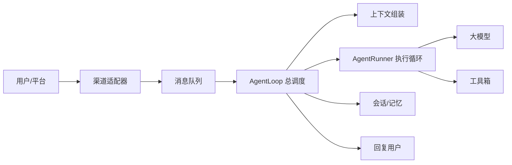

# Nanobot 整体架构通俗说明

nanobot 可以理解成一个“带工具箱和档案室的 AI 工作台”。

它不只是把用户消息直接丢给大模型，然后等一个回答。它会先把来自不同平台的消息统一整理，再给模型准备上下文，让模型根据需要调用工具，保存过程和结果，并在会话变长时自动压缩旧内容。

## 总览



## 核心角色

### 渠道适配器

渠道适配器负责接入不同平台，例如 CLI、WebUI、OpenAI-compatible API、Telegram、Slack、Discord 等。

不同平台的消息格式各不相同。nanobot 会先把这些消息转换成统一的 `InboundMessage`，这样后面的 agent 核心就不用关心消息到底来自哪里。

### 消息队列

消息队列可以理解成一条传送带。

用户发来的消息先进队列，agent 从队列里取消息处理。处理完之后，agent 再把回复放回另一个队列，由对应的平台发送给用户。

这样做的好处是：平台接入和 agent 核心互相解耦。新增一个聊天平台时，不需要重写 agent 的核心逻辑。

### AgentLoop 总调度

`AgentLoop` 是 nanobot 的总调度。

它负责判断：

- 这条消息属于哪个会话。
- 是否需要恢复上次中断的任务。
- 是否是 slash command。
- 是否需要压缩旧上下文。
- 应该给模型准备哪些历史、记忆和运行信息。
- 模型运行结束后如何保存历史。
- 最终应该怎么回复用户。

可以把它理解成“项目经理”或者“中控台”。

### ContextBuilder 上下文组装

大模型每次工作前，都需要一份“开卷资料”。`ContextBuilder` 就负责准备这份资料。

它会组装：

- 系统身份和运行环境。
- 当前 workspace 路径。
- 项目里的 `AGENTS.md`、`SOUL.md`、`USER.md` 等启动文件。
- 工具使用规则。
- 长期记忆。
- 可用 skill 列表。
- 最近会话历史。
- 当前时间、平台、chat id 等运行元信息。

所以模型看到的不是孤零零的一句用户输入，而是一份经过整理的上下文包。

### AgentRunner 执行循环

`AgentRunner` 是真正执行“模型 + 工具”循环的地方。

它反复做下面这件事：

1. 把当前上下文发给模型。
2. 如果模型直接回答，就结束。
3. 如果模型要求调用工具，就执行工具。
4. 把工具结果追加回上下文。
5. 再次询问模型。
6. 一直循环，直到得到最终回答，或者达到最大迭代次数。

这就是 nanobot 的核心 agent loop。

### 工具箱

工具箱是模型能调用的能力集合。

常见工具包括：

- 读文件、写文件、编辑文件。
- 搜索文件和目录。
- 执行 shell 命令。
- 网页搜索和网页抓取。
- 发送消息和附件。
- 定时任务。
- 图片生成。
- MCP 工具。
- 启动 subagent。

模型本身不会真的读文件或跑命令，它只是提出工具调用请求。真正执行工具的是 nanobot 的工具系统。

### 会话和记忆

nanobot 会把对话历史保存到 session 文件里。

每个 channel/chat 通常有独立 session，也可以配置成 unified session，让多个平台共享同一个会话。

历史变长后，nanobot 不会无限制地把全部内容塞给模型。它会：

- 只 replay 最近一部分历史。
- 对旧工具结果做压缩。
- 按 token budget 裁剪上下文。
- 把旧对话摘要归档到 memory/history。
- 在需要时把摘要重新注入上下文。

这让 nanobot 可以更长期地运行，而不会因为上下文越来越大而失控。

## 一条消息的生命周期

一条普通用户消息大致这样流动：

1. 用户在某个平台发消息。
2. 对应 Channel 把它转换成统一的 `InboundMessage`。
3. 消息进入 `MessageBus`。
4. `AgentLoop` 从队列取出消息。
5. `AgentLoop` 找到对应 session。
6. 它恢复可能存在的中断 checkpoint。
7. 它检查是否需要自动压缩旧历史。
8. 它判断这是不是一个命令。
9. 如果不是命令，就构建模型上下文。
10. `AgentRunner` 调用大模型。
11. 如果模型需要工具，Runner 执行工具。
12. 工具结果返回给模型。
13. 模型继续推理，直到给出最终回答。
14. `AgentLoop` 保存这一轮的新消息和工具结果。
15. 回复被包装成 `OutboundMessage`。
16. `MessageBus` 把回复交给对应 Channel。
17. Channel 把回复发回用户所在平台。

## Agent Loop 的两层结构

nanobot 的 agent loop 可以分成两层。

### 第一层：单次对话状态机

这是 `AgentLoop` 管的流程：

```text
恢复 -> 压缩 -> 命令判断 -> 构建上下文 -> 运行模型 -> 保存 -> 回复
```

这一层关注的是“这一轮对话怎么被正确处理”。

它处理会话、历史、命令、保存、回复和恢复。

### 第二层：模型工具循环

这是 `AgentRunner` 管的流程：

```text
问模型 -> 模型要求工具 -> 执行工具 -> 工具结果给模型 -> 再问模型 -> 最终回答
```

这一层关注的是“模型如何一步步完成任务”。

所以 nanobot 不是只问模型一次，而是允许模型观察工具结果后继续行动。

## Mid-Turn Injection

nanobot 有一个比较重要的机制：mid-turn injection。

意思是：如果某个 session 正在运行，用户又发来新消息，nanobot 不会立刻开一个并发的新任务和旧任务抢同一段历史。

它会把新消息放进这个 session 的 pending queue。

Runner 在合适的节点检查 pending queue，例如：

- 工具执行完成之后。
- 最终回答之前。
- 模型报错之后。
- 达到迭代上限之后。

如果有新消息，就把它注入当前上下文，让模型继续处理。

这样可以避免同一个会话里多个 agent turn 互相打架。

## Skill 机制

nanobot 的 skill 是一组 Markdown 指南，告诉模型如何完成某类任务或使用某类工具。

skill 不等于代码插件。它更像是“给模型看的操作手册”。

nanobot 对 skill 做了分层加载：

- `always` skill：全文直接进入 system prompt。
- 普通 skill：只把名称、描述和路径放进 skill 索引。
- 当模型需要某个普通 skill 时，再用 `read_file` 读取它的 `SKILL.md`。

这样既能让模型知道有哪些能力，又不会一开始就把所有 skill 全文塞进上下文。

## Subagent

subagent 可以理解成“被主 agent 派出去做子任务的小助手”。

主 agent 可以调用 `spawn` 工具启动 subagent。subagent 使用独立的工具集合和专门的 system prompt 执行任务。

任务完成后，subagent 不直接回复用户，而是把结果通过消息队列注入回主会话。主 agent 再根据结果继续处理或回复用户。

这适合复杂、耗时、可以并行或可以拆分的任务。

## 长上下文治理

nanobot 很重视上下文治理。

它不会简单粗暴地把所有历史都发给模型，而是分几层处理：

- Session 里保存完整历史。
- 每次请求模型前，只取最近的合法历史片段。
- 对旧的工具结果进行 microcompact。
- 对超大的工具结果进行截断或落盘。
- 根据 context window 裁剪过长历史。
- 通过 Consolidator 把旧消息摘要进 memory/history。
- idle session 可以自动 compact。

这样可以兼顾长期记忆、成本、速度和模型上下文限制。

## 崩溃恢复

nanobot 在工具调用等关键阶段会保存 runtime checkpoint。

如果任务运行中被取消、进程崩溃，下一次同 session 继续时，nanobot 会尝试恢复已经完成的 assistant/tool 消息。

如果只来得及保存 user 消息，还没生成 assistant 回复，也会补一个中断提示，避免 session 卡在不完整状态。

## 主要特性

- 多入口：CLI、WebUI、OpenAI-compatible API、聊天平台。
- 多模型：支持多种 provider 和 OpenAI-compatible 接口。
- 工具调用：文件、命令、网页、消息、定时任务、图片、MCP 等。
- 会话隔离：不同 channel/chat 独立 session，也支持 unified session。
- 长期记忆：支持 memory 文件、history 归档和 Dream 周期任务。
- Skill 系统：按需读取能力说明，减少上下文浪费。
- Subagent：支持把复杂任务拆给后台子 agent。
- 流式输出：支持实时回复、reasoning、工具进度和文件编辑事件。
- 上下文压缩：自动裁剪、摘要、压缩旧内容。
- 崩溃恢复：通过 checkpoint 尽量保存中间结果。
- 安全边界：workspace 限制、SSRF 防护、工具参数校验等。

## 一句话总结

nanobot 的架构是：

```text
多渠道输入 + 统一消息总线 + 会话化 Agent 调度 + 模型工具循环 + 记忆压缩系统
```

它的强点不是单独某个模型，而是把模型、工具、记忆、平台和长任务组织成一个可以持续运行的 AI 工作系统。
