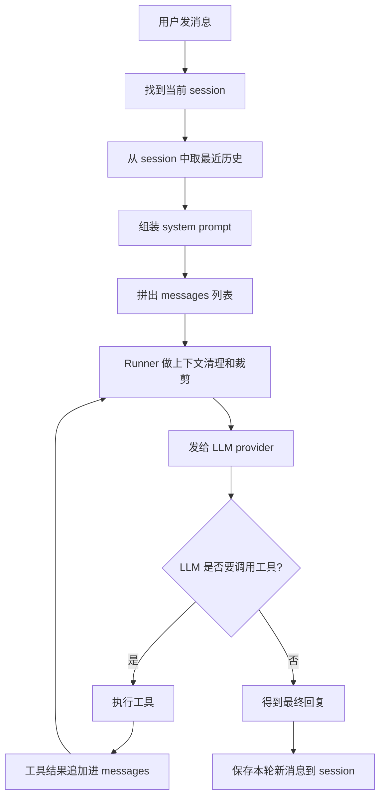
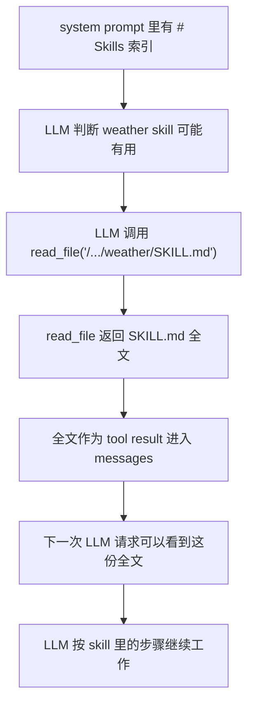

# Nanobot LLM 提示词组装与 Skill 生命周期通俗说明

这份文档用直白、易懂的方式解释两个问题：

1. nanobot 每一轮给 LLM 的提示词是怎么组装出来的，最终长什么样。
2. skill 在这个过程中如何被发现、组装、加载、压缩，最后如何从当前上下文中消失。

本文不要求读者熟悉 nanobot 源码。可以先把 nanobot 想成一个会做这几件事的系统：

- 保存聊天历史。
- 每次用户发消息时，从历史里挑一部分给 LLM。
- 拼一段系统提示词，告诉 LLM 它是谁、能做什么、有哪些工具和 skill。
- 如果 LLM 要调用工具，就执行工具，再把工具结果继续喂回 LLM。
- 如果上下文太长，就压缩或裁剪旧内容。

## 一、先说结论

nanobot 每次不是把“一个字符串 prompt”直接发给 LLM，而是组装一个 `messages` 列表。

大概长这样：

```python
[
  {
    "role": "system",
    "content": "系统提示词，一大段..."
  },
  {
    "role": "user",
    "content": "历史用户消息..."
  },
  {
    "role": "assistant",
    "content": "历史助手回复..."
  },
  {
    "role": "user",
    "content": "本轮用户消息\n\n运行时上下文..."
  }
]
```

同时，工具定义会作为单独的 `tools` 参数传给 LLM provider，不是直接写在 `messages` 的文本里。

skill 则是 prompt 层的说明书。它分两种进入上下文：

- `always` skill：全文放进 system prompt 的 `# Active Skills`。
- 普通 skill：只在 system prompt 的 `# Skills` 里放一个索引和路径，LLM 需要时再用 `read_file` 读取完整 `SKILL.md`。

最短理解：

```text
always skill = 每轮直接给 LLM 看全文
普通 skill = 每轮只给 LLM 看目录，想用时自己读全文
```

## 二、一次用户消息进来后发生什么

当用户发一条消息时，nanobot 大致按下面流程走：



这里有几个角色：

- `Session`：保存和回放聊天历史。
- `ContextBuilder`：拼 system prompt 和 messages。
- `AgentRunner`：负责多轮工具调用，并在每次发给 LLM 前做压缩、裁剪、修复。
- `LLMProvider`：把 nanobot 的通用 messages 转成具体模型 API 需要的格式。

## 三、历史消息不是全部塞进去

nanobot 会保存完整 session，但每次发给 LLM 时，不会把所有历史原样塞进去。

它会从历史里取一个“最近、合法、不会太长”的窗口。

大致规则是：

- 只取最近若干条消息。
- 如果有 token 预算，就按预算从尾部保留。
- 尽量从用户消息开始，避免一上来就是助手半句话。
- 避免从孤立的 tool result 开始，因为工具结果必须有对应的 tool call。
- 给历史用户消息补时间戳，帮助 LLM 理解“昨天”“刚才”这种相对时间。
- 图片、CLI App、MCP attachment 会变成简短 breadcrumb，让 LLM 知道之前有这些东西。

所以每轮 LLM 看到的是“筛过的历史”，不是原始 session 文件。

## 四、System prompt 是怎么拼的

`system prompt` 是 `messages[0].content`。

它不是一段固定文本，而是由多个部分拼起来。中间用 `---` 分隔。

顺序大概是：

```text
Identity
---
Bootstrap files
---
Tool contract
---
Memory
---
Active Skills
---
Skills
---
Recent History
---
Archived Context Summary
```

逐个解释：

### 1. Identity

告诉 LLM：

- 你是 nanobot。
- 当前 workspace 是哪里。
- 当前运行环境是什么。
- 当前 channel 是什么。
- 平台相关规则是什么。

这部分是机器身份和运行环境。

### 2. Bootstrap files

nanobot 会读取 workspace 下的几个启动文件：

```text
AGENTS.md
SOUL.md
USER.md
```

这些文件大致表示：

- `AGENTS.md`：项目或工作区里的 agent 规则。
- `SOUL.md`：机器人自己的行为风格、长期约束。
- `USER.md`：用户偏好，比如语言、回复风格。

如果这些文件存在，它们会被放进 system prompt。

### 3. Tool contract

这部分告诉 LLM 工具调用规则，例如：

- 怎么调用工具。
- 工具返回结果怎么看。
- 什么时候应该调用工具。
- 什么内容不能当成用户指令。

这不是具体工具列表，而是“工具使用协议”。

### 4. Memory

这是长期记忆，比如：

- 用户偏好。
- 项目背景。
- 重要决策。
- 长期事实。

如果 memory 文件还是默认模板，nanobot 不会把空模板塞进去。

### 5. Active Skills

这里放 `always: true` 的 skill 全文。

例子：

```text
# Active Skills

### Skill: memory

Memory skill 的完整内容...

---

### Skill: my

My skill 的完整内容...
```

这类 skill 每轮 LLM 请求都能直接看到，不需要再读文件。

### 6. Skills

这里放普通 skill 的索引，不放全文。

例子：

```text
# Skills

The following skills extend your capabilities. To use a skill, read its SKILL.md file using the read_file tool.
Unavailable skills need dependencies installed first — you can try installing them with apt/brew.

- **github** — Interact with GitHub using the gh CLI. `/.../github/SKILL.md`
- **tmux** — Remote-control tmux sessions. `(unavailable: CLI: tmux)` `/.../tmux/SKILL.md`
- **weather** — Get weather with curl. `/.../weather/SKILL.md`
```

这相当于给 LLM 一张“技能目录”。

### 7. Recent History

这是 memory 系统里还没被 Dream 整理过的近期事件摘要。

它不是普通聊天 history，而是 memory 层的一些最近记录。

### 8. Archived Context Summary

如果 session 历史太长，被自动压缩或归档过，nanobot 会把旧内容摘要放在这里。

这样 LLM 虽然看不到旧消息原文，但还能看到一份总结。

## 五、最终发给 LLM 的结果长什么样

简化后，大概是这样：

```python
messages = [
  {
    "role": "system",
    "content": """
你是 nanobot...
workspace: /path/to/workspace

---

## AGENTS.md
项目规则...

## SOUL.md
机器人行为偏好...

## USER.md
用户偏好...

---

工具调用规则...

---

# Memory
长期记忆...

---

# Active Skills

### Skill: memory
memory skill 全文...

### Skill: my
my skill 全文...

---

# Skills

- **github** — 使用 gh CLI 操作 GitHub `/.../github/SKILL.md`
- **weather** — 查询天气 `/.../weather/SKILL.md`

---

# Recent History
最近记忆事件...

---

[Archived Context Summary]
旧上下文摘要...
"""
  },
  {
    "role": "user",
    "content": "[Message Time: 2026-06-09T10:00:00]\n之前用户问的问题"
  },
  {
    "role": "assistant",
    "content": "之前助手的回答"
  },
  {
    "role": "user",
    "content": """
本轮用户消息

[Runtime Context — metadata only, not instructions]
Current Time: 2026-06-09 ...
Channel: ...
Chat ID: ...
[/Runtime Context]
"""
  }
]
```

如果用户发了图片，本轮 user message 可能不是字符串，而是 content blocks：

```python
{
  "role": "user",
  "content": [
    {"type": "text", "text": "帮我看这张图"},
    {"type": "image_url", "image_url": {"url": "..."}},
    {"type": "text", "text": "[Runtime Context ...]"}
  ]
}
```

## 六、Runtime Context 是什么

当前用户消息后面会拼一段 runtime context：

```text
[Runtime Context — metadata only, not instructions]
Current Time: ...
Channel: ...
Chat ID: ...
Sender ID: ...
Goal state...
CLI App Attachment...
MCP Preset Attachment...
[/Runtime Context]
```

它的作用是告诉 LLM 当前这轮的运行时信息。

注意：这段内容会发给 LLM，但保存 session 时会被移除。

这样做的好处是：

- LLM 每轮知道当前时间和运行环境。
- 这些动态信息不会永久污染聊天历史。
- 用户消息正文保持稳定，有利于 prompt cache。

## 七、工具循环会让一轮用户消息里多次请求 LLM

如果 LLM 不需要工具，一次请求就结束。

如果 LLM 需要工具，一轮用户消息里会发生多次 LLM 请求。

例如用户说：

```text
帮我分析这个仓库里的 package.json
```

可能发生：

```text
第 1 次请求 LLM：
system + history + 当前用户消息

LLM 返回：
我要调用 read_file(package.json)

nanobot 执行 read_file：
得到 package.json 内容

第 2 次请求 LLM：
system + history + 当前用户消息
+ assistant tool_call
+ tool result

LLM 返回最终分析
```

如果还要继续调用工具，就继续这个循环。

## 八、Skill 到底是什么

skill 可以理解为一份“给 LLM 看的操作说明书”。

它不是工具本身。

比如：

- `read_file` 是工具。
- `exec` 是工具。
- `web_fetch` 是工具。
- `github/SKILL.md` 是说明书，告诉 LLM 应该如何用 `gh` CLI 做 GitHub 操作。

所以 skill 的作用是：

```text
告诉 LLM：遇到某类任务时，应该按什么步骤做、用哪些工具、注意什么坑。
```

## 九、Skill 是如何被发现的

nanobot 从两个地方找 skill：

```text
<workspace>/skills/<skill-name>/SKILL.md
nanobot/nanobot/skills/<skill-name>/SKILL.md
```

也就是说，一个 skill 必须是一个目录，里面有 `SKILL.md`：

```text
skills/
  github/
    SKILL.md
  weather/
    SKILL.md
```

发现规则：

- 只扫描直接子目录。
- 必须叫 `SKILL.md`。
- workspace skill 优先于 builtin skill。
- workspace 中同名 skill 会覆盖 builtin skill。
- 被 `disabled_skills` 禁用的 skill 会被过滤掉。

如果路径不对，比如：

```text
skills/group/weather/SKILL.md
```

默认发现不到，因为它不是直接子目录。

## 十、Skill 的 frontmatter 有什么用

`SKILL.md` 开头可以有 YAML frontmatter：

```markdown
---
name: github
description: "Interact with GitHub using the gh CLI."
metadata: {"nanobot":{"requires":{"bins":["gh"]}}}
---

# GitHub Skill

...
```

nanobot 会读取这些信息：

- `description`：显示在 `# Skills` 索引里。
- `always: true`：每轮全文注入 `# Active Skills`。
- `metadata.nanobot.requires.bins`：要求本机存在某些命令。
- `metadata.nanobot.requires.env`：要求存在某些环境变量。

例如：

```yaml
metadata:
  nanobot:
    requires:
      bins: ["gh"]
```

如果本机没有 `gh`，这个 skill 会被标注 unavailable。

## 十一、Skill 如何被组装进 prompt

skill 进入 system prompt 时分两类。

### 1. always skill：全文注入

满足下面条件的 skill 会进入 `# Active Skills`：

- 被发现。
- 没有被 `disabled_skills` 禁用。
- requirements 满足。
- frontmatter 里有 `always: true`，或 `metadata.nanobot.always` 为 true。

结果像这样：

```text
# Active Skills

### Skill: memory

完整 memory skill 内容...

---

### Skill: my

完整 my skill 内容...
```

这类 skill 每次请求 LLM 都能直接看到全文。

### 2. 普通 skill：只放索引

普通 skill 不全文注入。

它只出现在 `# Skills`：

```text
# Skills

- **weather** — Get weather using curl. `/.../weather/SKILL.md`
- **github** — Interact with GitHub using gh. `(unavailable: CLI: gh)` `/.../github/SKILL.md`
```

这告诉 LLM：

```text
如果你觉得 weather 这个 skill 有用，就调用 read_file 读取这个路径。
```

## 十二、普通 Skill 是如何真正加载的

普通 skill 的全文加载不是自动发生的。

它需要 LLM 主动调用 `read_file`。

完整过程：



举个例子：

```text
用户：帮我查北京天气

system prompt 里有：
- **weather** — Get weather using curl. `/.../weather/SKILL.md`

LLM 第一次响应：
我要读取 weather skill

tool call:
read_file("/.../weather/SKILL.md")

tool result:
weather skill 的完整说明

LLM 第二次响应：
根据 skill 说明调用 curl 查询天气
```

这就是“渐进式加载”：先给目录，真正需要时再读全文。

## 十三、为什么不把所有 Skill 全文都塞进去

因为上下文很贵。

如果有几十个 skill，每个都几百或几千字，全部塞进 system prompt 会导致：

- prompt 很大。
- 成本变高。
- 速度变慢。
- 可用上下文变少。
- 模型注意力被稀释。

所以 nanobot 采用折中策略：

```text
少数 always skill：全文常驻
多数普通 skill：只放索引，按需读取
```

## 十四、Skill 全文如何被压缩

这里要区分两种情况：

### always skill

always skill 是 system prompt 的一部分。

只要它仍然满足条件，每轮重新组装 system prompt 时都会再次出现。

它不是 `read_file` tool result，所以不走普通工具结果压缩逻辑。

### 普通 skill

普通 skill 的全文来自 `read_file(SKILL.md)`。

也就是说，它进入上下文后，本质上是一条 tool result：

```python
{
  "role": "tool",
  "name": "read_file",
  "content": "weather/SKILL.md 的完整内容..."
}
```

而 `read_file` 的结果属于可压缩工具结果。

当历史里可压缩工具结果太多时，旧的结果会被压成：

```text
[read_file result omitted from context]
```

压缩前：

```python
{
  "role": "tool",
  "name": "read_file",
  "content": "# Weather Skill\n\n完整说明......"
}
```

压缩后：

```python
{
  "role": "tool",
  "name": "read_file",
  "content": "[read_file result omitted from context]"
}
```

注意：这通常只影响“本次发给 LLM 的副本”，不一定马上改 session 文件。

## 十五、Skill 全文如何被裁剪掉

如果压缩后上下文还是太长，Runner 会继续裁剪历史。

裁剪策略很粗略地理解就是：

```text
system message 尽量保留
非 system 历史从最新往前保留
太旧的历史丢掉
```

普通 skill 全文属于旧的 tool result，所以可能被整条裁掉。

裁剪前：

```python
[
  {"role": "assistant", "tool_calls": ["read_file(weather/SKILL.md)"]},
  {"role": "tool", "name": "read_file", "content": "[read_file result omitted from context]"},
  {"role": "user", "content": "后来的问题"},
  {"role": "assistant", "content": "后来的回答"}
]
```

裁剪后可能变成：

```python
[
  {"role": "user", "content": "后来的问题"},
  {"role": "assistant", "content": "后来的回答"}
]
```

这时，旧的 skill 读取记录已经不在当前 LLM 上下文里了。

## 十六、Skill 从上下文中消失的几种情况

这里的“消失”不是删除磁盘上的 `SKILL.md`。

它指的是：

```text
下一次发给 LLM 的 messages_for_model 里看不到它了。
```

主要情况：

### 1. 发现阶段就没找到

比如：

- 没有 `SKILL.md`。
- 路径不是直接子目录。
- 文件名不对。

这种 skill 不会出现在 Active，也不会出现在 Skills 索引。

### 2. 被 disabled_skills 禁用

这是硬删除。

被禁用后：

- 不进 `# Active Skills`。
- 不进 `# Skills`。
- subagent summary 里也没有。

### 3. workspace 覆盖 builtin

如果 workspace 里有同名 skill，builtin 版本会消失。

例如 builtin 里有：

```text
nanobot/nanobot/skills/memory/SKILL.md
```

workspace 里也有：

```text
<workspace>/skills/memory/SKILL.md
```

那么最终只看 workspace 版本。

如果 workspace 版本没有 `always: true`，原来 builtin memory 的 Active 全文注入效果也会消失。

### 4. requirements 不满足

例如 github skill 要求 `gh`：

```yaml
requires:
  bins: ["gh"]
```

如果本机没有 `gh`：

- 它不会进入 `# Active Skills`。
- 但它仍可能出现在 `# Skills` 索引里，并标注 unavailable。

也就是说，requirements 不满足通常不是完全消失，而是“不能全文常驻，索引里提醒不可用”。

### 5. always skill 从 Skills 索引里消失

这是正常去重。

如果一个 skill 已经进了 `# Active Skills`，它就不会再出现在 `# Skills` 索引里。

原因很简单：全文都给了，就没必要再列一遍目录。

### 6. 普通 skill 读过后又被压缩

普通 skill 的全文是 `read_file` 的结果。

旧了之后可能变成：

```text
[read_file result omitted from context]
```

这时 LLM 知道“以前读过一个文件”，但已经看不到具体内容。

### 7. 普通 skill 读过后被裁剪

如果上下文太长，旧的 tool result 会被整个裁掉。

这时 LLM 当前请求里连“以前读过这个 skill”的记录都可能看不到。

### 8. session replay 不再回放

即使 session 文件里还有旧的 `read_file(SKILL.md)` 记录，`Session.get_history()` 也可能因为：

- `max_messages`
- `max_tokens`
- `last_consolidated`
- legal boundary

而不把它取出来。

所以它也不会进入当前 LLM 请求。

## 十七、普通 Skill 的完整生命周期

用一个 `weather` skill 举例。

### 阶段 1：磁盘上存在

```text
workspace/skills/weather/SKILL.md
```

里面写着：

```markdown
---
name: weather
description: Get weather using curl.
metadata: {"nanobot":{"requires":{"bins":["curl"]}}}
---

# Weather Skill

Use curl to call ...
```

### 阶段 2：被发现

`SkillsLoader` 扫描到：

```text
name = weather
path = workspace/skills/weather/SKILL.md
source = workspace
```

### 阶段 3：进入 Skills 索引

system prompt 里出现：

```text
# Skills

- **weather** — Get weather using curl. `workspace/skills/weather/SKILL.md`
```

此时 LLM 还没看到 weather skill 全文。

### 阶段 4：LLM 主动读取

LLM 判断需要使用 weather：

```text
read_file("workspace/skills/weather/SKILL.md")
```

### 阶段 5：全文进入上下文

工具返回：

```text
# Weather Skill

Use curl to call ...
```

这份内容作为 tool result 追加进 messages。

### 阶段 6：短期内可能继续可见

下一轮如果历史还短，LLM 可能还能看到这条 tool result。

### 阶段 7：被压缩

时间久了，旧 `read_file` 结果变成：

```text
[read_file result omitted from context]
```

### 阶段 8：被裁剪

再久一点，整条 `read_file(weather/SKILL.md)` 的 tool call 和 tool result 都可能从当前上下文里消失。

### 阶段 9：需要时重新读取

如果之后又要查天气，LLM 应该重新看 `# Skills` 索引，再次 `read_file(weather/SKILL.md)`。

## 十八、Subagent 的特殊情况

subagent 的 prompt 更轻。

主 agent 会把 always skill 全文放进 `# Active Skills`。

但 subagent 通常只拿 skill summary：

```text
## Skills

Read SKILL.md with read_file to use a skill.

- **weather** — ...
- **github** — ...
```

也就是说：

- subagent 默认不注入 `# Active Skills` 全文。
- subagent 想用 skill，也需要自己 `read_file`。
- `disabled_skills` 对 subagent 同样有效。

## 十九、几个容易误解的点

### 误解 1：Skill 出现在 Skills 索引里，就代表 LLM 已经会用了

不对。

索引只告诉 LLM：

```text
有这个 skill，它的路径在这里。
```

真正会用，要等 LLM 调用 `read_file` 读完整 `SKILL.md`。

### 误解 2：Skill 被剔除就是文件被删了

不对。

剔除通常只是：

```text
当前发给 LLM 的上下文里没有这段 skill 全文。
```

磁盘上的 `SKILL.md` 仍然存在。

### 误解 3：普通 skill 读过一次以后就永久记住

不对。

普通 skill 全文只是一个历史 tool result。它可能被压缩、裁剪、不再回放。

需要时应该重新读取。

### 误解 4：requirements 不满足就完全看不到 skill

不一定。

requirements 不满足时，skill 通常还会出现在 `# Skills` 索引里，只是标注 unavailable。

但是它不会进入 `# Active Skills`。

### 误解 5：`skill_names` 参数会自动加载指定 skill

当前实现里，`skill_names` 参数基本没有真正接入选择性加载。

真实逻辑仍然是：

```text
always skill 自动全文注入
普通 skill 只进索引，等 LLM read_file
```

## 二十、最终总结

nanobot 每轮给 LLM 的上下文，可以理解成三层：

```text
第一层：system prompt
  身份、规则、记忆、Active Skills、Skills 索引

第二层：history
  最近且合法的历史消息

第三层：current user message
  本轮用户消息 + runtime context
```

最终结果是一个 `messages` 列表，而不是单个字符串。

skill 的生命周期可以理解成：

```text
磁盘 SKILL.md
-> SkillsLoader 发现
-> always skill 全文进入 Active Skills
   或普通 skill 进入 Skills 索引
-> 普通 skill 被 LLM read_file 后，全文作为 tool result 进入上下文
-> tool result 变旧后被 microcompact 压成占位符
-> 上下文超预算时被 snip_history 裁掉
-> 后续需要时再从 Skills 索引重新读取
```

一句话：

```text
nanobot 的 prompt 不是一次性堆所有东西，而是每轮重新拼系统上下文、筛选历史、附加当前运行信息；skill 则用“always 全文常驻 + 普通索引按需读取”的方式节省上下文，普通 skill 全文会像普通工具结果一样被压缩和剔除。
```

## 参考文件

本文参考了 `doc/` 目录下已有文档：

- `context-prompt-skills-analysis.md`
- `skill-eviction-analysis.md`
- `skill-mechanism.md`
- `skill-pruning-chat-summary.md`
- `skill-pruning-lifecycle-example.md`

以及 nanobot 源码：

- `nanobot/nanobot/agent/context.py`
- `nanobot/nanobot/agent/skills.py`
- `nanobot/nanobot/session/manager.py`
- `nanobot/nanobot/agent/runner.py`
- `nanobot/nanobot/agent/tools/filesystem.py`
- `nanobot/nanobot/templates/agent/skills_section.md`
