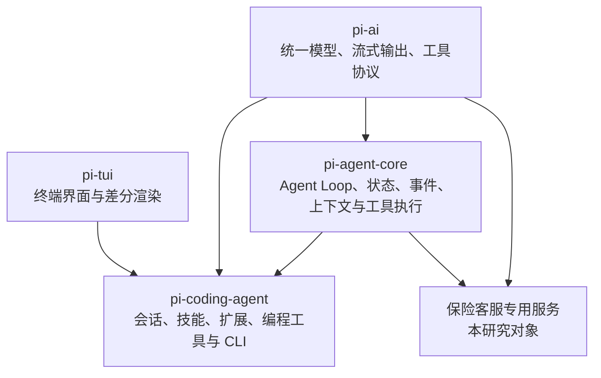
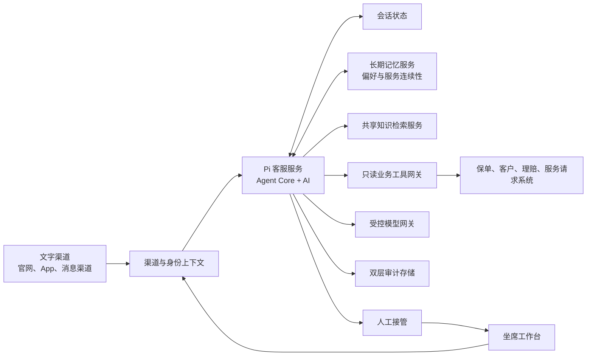
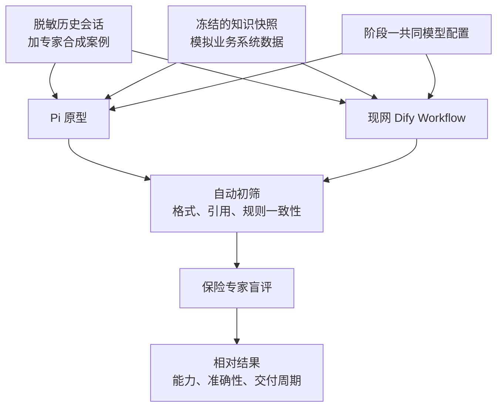

# Pi-Mono 保险智能客服技术档案

## 文档信息

| 项目            | 内容                                                         |
| --------------- | ------------------------------------------------------------ |
| 文档用途        | 技术选型研究与研究性 PoC 设计                                |
| 主要读者        | 架构委员会、研发团队                                         |
| 资料快照日期    | 2026 年 6 月 10 日                                           |
| Pi 基线         | `v0.79.1`，发布于 2026 年 6 月 9 日                          |
| Pi 核心包       | `@earendil-works/pi-agent-core`、`@earendil-works/pi-ai`     |
| Dify 基线       | 现网 Dify 企业版私有部署，准确版本待补                       |
| Dify 最新版背景 | 官方开源仓库最新稳定版为 `1.14.2`，发布于 2026 年 5 月 19 日 |
| 业务范围        | 中国香港，寿险、医疗险及一般保险                             |
| 渠道范围        | 文字渠道优先，面向客户与坐席双端                             |
| 文档立场        | 中性比较，不预设 Pi 或 Dify 胜出                             |

> **范围声明**
>
> 本文比较的是基于 Pi-Mono 核心包构建的专用 Agent 原型，以及现网大型集中式 Dify Workflow 的实际实现。本文不比较 Dify Chatflow、Dify Agent 应用或完整 Dify 企业平台，也不能据此得出“Pi 优于 Dify 平台”的结论。
>
> 本文不进行成本测算、性能压测、威胁模型、安全对抗测试、生产化差距分析或法律合规意见。研究性 PoC 的功能表现不能直接解释为生产可用性。

## 1. 执行摘要

Pi-Mono 当前官方仓库将自身定位为 **Pi Agent Harness Mono Repo**。它不是开箱即用的客服平台，而是一组以 TypeScript 为主的 Agent 开发组件：`pi-ai` 统一不同模型供应商的调用方式，`pi-agent-core` 提供带状态的 Agent Loop、工具调用、事件流和上下文转换能力，Coding Agent 在此基础上加入会话、扩展、技能和终端工具，TUI 则负责终端交互界面。

对于保险智能客服，合理的研究对象不是完整 Pi Coding Agent，而是使用 `pi-agent-core + pi-ai` 构建受控服务。该服务只获得知识检索和业务系统只读工具，不继承文件读写、Shell、代码编辑等编程工具。渠道、身份、知识库、长期记忆、人工接管和审计均由外围系统提供。

Pi 对现网大型集中式 Dify Workflow 的潜在价值主要来自运行时方式的不同。大型 Workflow 通常把意图、分支、调用顺序和异常路径预先画进流程图；Pi Agent Loop 则可以让模型在白名单工具范围内，根据当前问题、已获得的证据和工具结果动态决定下一步。对于跨意图、多步骤、需要连续澄清的问题，这种方式有机会减少分支组合爆炸，并提高长尾问题覆盖率。

这项优势并非无条件成立。首先，最新版 Dify 官方文档已经提供 Workflow 内的 Agent 节点，可让模型自主选择工具，因此不能把“动态工具调用”描述成 Pi 独有能力。现网版本是否包含该能力、是否已经使用，以及使用效果如何，均需要单独核实。其次，Pi 的灵活性来自代码和宿主应用，它不会自动提供 Dify 企业版已有的可视化编排、应用发布、工作区管理和运营界面。最后，当前团队以 Java/Python 为主，Pi 的 TypeScript 技术栈可能降低其新场景交付优势。

本次研究因此采用独立并行方式：Pi 与 Dify 不互相调用；Pi 只进行脱敏历史会话影子评测和少量坐席建议试用，不直接回复真实客户。两边使用同一知识快照、同一只读业务数据、相同模型基线和统一标准答案。评测同时关注复杂问题解决能力、多轮准确性和新场景从需求确认到回归通过的交付周期。

本报告不提供单一推荐。Pi 表现更好，只能说明当前动态 Agent 原型值得继续研究；Dify 表现更好，也可能说明现有场景更适合确定性流程，或现有条件不足以发挥 Pi 的机制优势。

## 2. Pi-Mono 技术档案

### 2.1 项目定位与名称

“pi-mono”是社区和历史资料中常见的项目称呼。当前官方仓库位于 `earendil-works/pi`，README 标题为 **Pi Agent Harness Mono Repo**。仓库采用 MIT 许可证，各主要 npm 包在 `v0.79.1` 使用统一版本号，并要求 Node.js `>=22.19.0`。

Pi 的设计重点是为 Agent 应用提供模型调用、工具执行、消息状态和交互组件。它没有预设保险、客服、知识库或业务流程领域模型。将其用于保险客服，本质上是使用通用 Agent Runtime 开发一套新的领域应用，而不是配置一个现成产品。

### 2.2 包关系

`pi-ai` 是最底层的模型适配层。`pi-agent-core` 建立在它之上，负责把模型响应、工具调用和后续模型调用组织成 Agent Loop。Coding Agent 同时依赖 `pi-agent-core`、`pi-ai` 和 `pi-tui`，加入更完整的会话与开发者交互能力。

保险客服原型只使用前两个包。Coding Agent 的 SDK、会话压缩、扩展和资源机制可以作为设计参考，但其默认编程任务定位、CLI/TUI 形态以及文件、Shell、编辑工具不属于本次方案。

### 2.3 `pi-ai` 的主要特性

`pi-ai` 提供统一的多模型调用接口。官方 README 列出的适配范围包括 OpenAI、Azure OpenAI Responses、Anthropic、Google、Vertex AI、Amazon Bedrock、Mistral、DeepSeek、OpenRouter、Cloudflare、xAI，以及多种兼容服务。其模型目录只纳入支持工具调用的模型。

统一接口的价值不只是把请求 URL 包装成同一种形式。不同供应商对消息角色、推理内容、工具调用、缓存、停止原因、Token 用量和错误格式存在差异，`pi-ai` 在公共类型和 provider 适配层中处理这些差异。应用可以使用 `getModel()` 获取模型定义，通过 `stream()` 或 `streamSimple()` 接收流式事件，也可以使用完成式调用获得最终结果。

工具定义使用 TypeBox 等结构化 schema，运行时可验证模型生成的参数，避免把未校验 JSON 直接传给业务系统。`pi-ai` 还提供 Token 用量、推理等级、图片输入、请求中止、错误归一化、自定义模型和兼容端点配置。本次只关注模型抽象、工具协议和上下文可转移性。

跨供应商切换是 Pi 的显著机制特征。公共消息结构允许应用在下一次调用时更换模型，provider 层处理部分消息差异。不过，模型能力、上下文长度和提示词敏感度仍可能改变结果，因此本次只验证人工切换和故障回退。

上下文可以序列化并在应用层保存。这为会话恢复、影子回放和跨模型实验提供基础，但持久化介质、客户隔离、保留期限和数据治理不是 `pi-ai` 自带功能。

### 2.4 `pi-agent-core` 的主要特性

`pi-agent-core` 提供一个带状态的 `Agent`。状态包含系统提示词、模型、思考等级、工具集合和消息历史。应用向 Agent 提交用户消息后，Agent 调用模型；如果模型返回工具调用，Agent 执行工具、追加工具结果，并再次调用模型，直到模型给出最终答复、发生错误、被中止，或命中应用定义的停止条件。

这一循环使下一步可以在运行中决定。例如模型先检索条款，再决定是否查询客户保单和案件。开发者不必为每种组合建立独立图分支，但必须通过工具、指令和停止条件约束行为。

Agent 的消息类型分为面向应用的 `AgentMessage` 和模型可理解的标准消息。应用可定义额外消息类型，例如“身份状态”“人工坐席备注”“长期记忆候选项”或“证据包”。`convertToLlm` 决定哪些消息需要传给模型，以及如何转换；纯界面状态可以被过滤，结构化业务状态可以改写成受控上下文。

`transformContext` 在每次模型调用前处理消息，可以裁剪旧消息、注入最新业务上下文、替换过期事实或生成摘要。建议明确区分三类信息：

- 当前用户明确表达的需求和已确认事实；
- 从权威知识或只读业务工具获得、带时间和来源的证据；
- 仅用于体验连续性的客户偏好与服务摘要。

保单状态、金额、理赔进度和服务请求状态不应从长期记忆直接注入为当前事实，而应在需要时重新查询权威系统。

### 2.5 工具调用与执行控制

Agent 工具包含名称、说明、参数 schema 和执行函数。模型只能看到当前注册并启用的工具。工具说明决定模型何时选择它，参数 schema 决定输入形状，执行函数则由宿主应用实现。

`beforeToolCall` 钩子在参数解析与验证后、实际执行前运行，可以阻止调用。`afterToolCall` 在工具执行结束后运行，可以调整返回内容、错误标志或提前终止提示。这些钩子适合实现保险工具网关之外的最后一道应用级检查，例如确认调用所需的客户上下文存在、隐藏不应进入模型的字段，或把底层错误转换为可处理结果。

多个工具调用可按并行或串行方式执行。Agent Core 默认支持并行执行，也允许全局或按工具要求串行。保险原型采用“独立查询并行、依赖查询串行”的规则：知识检索、客户基本信息和案件列表等无依赖查询可以并行；必须先取得保单 ID 才能查询某项权益的调用应串行。并发选择由工具定义和调用依赖共同决定，不能仅以降低等待时间为目标。

### 2.6 事件流与交互控制

Agent 发出 Agent、Turn、消息和工具执行的开始、增量及结束事件，可驱动流式显示、坐席状态和基础日志。运行时还可加入 steering 或 follow-up 消息，但本次不设计实时人工干预协议。

`prepareNextTurn` 可以在一轮工具执行后、下一次模型调用前更新上下文、模型或思考等级。它为人工模型切换、故障回退和按回合刷新证据提供了入口。本次只验证受控模型切换，不让模型自行决定供应商。

### 2.7 Agent Harness 的补充说明

`pi-agent-core` 还有 Agent Harness 文档，涉及会话持久化、运行配置、资源、操作锁和保存点。官方同时注明部分生命周期与 durable recovery 语义仍在规划或加固。因此，不把完整恢复或企业级运行保障视为 `v0.79.1` 已无条件具备的能力。

### 2.8 Coding Agent 与 TUI

Pi Coding Agent 提供会话压缩、树形导航、资源加载、Skills、扩展、命令和终端界面，展示了如何围绕 Agent Core 建立完整应用。但官方明确提醒 Pi 默认没有内建的文件、进程、网络或凭据权限隔离。保险方案不加载其默认工具，也不依赖 CLI 或 `pi-tui`。

## 3. 香港保险智能客服适配

### 3.1 目标场景

本研究覆盖寿险、医疗险和一般保险，面向客户与坐席双端，首期支持繁体中文和英文文字交互。重点不是标准 FAQ，而是跨意图、多步骤问题，例如客户在同一对话中同时询问保单状态、保障范围、理赔资料和服务申请进度，并在后续消息中补充或修正条件。

客户侧输出强调简洁、克制和可核验；坐席侧显示更完整的证据和未决问题。系统只解释官方资料和权威系统中的既有状态，不作承保、责任或赔付决定。证据不足时最多澄清两轮，之后停止推测并转人工。

### 3.2 PoC 概念架构

Pi 客服服务接收渠道已经建立的登录态和受限用户上下文。PoC 沿用现有渠道身份，不增加分级加强认证。该假设只用于功能研究，不构成对现有身份保证强度的评价。

共享知识检索服务向 Pi 和 Dify 返回相同版本、排序结果和元数据，以分离知识质量与编排能力。知识覆盖产品、条款、FAQ、服务流程和业务规则，并按评测轮次冻结。

只读工具网关连接客户、保单、理赔和服务请求系统。每次调用携带受限上下文，由网关校验范围并裁剪字段。Pi 不获得写操作。

受控模型网关位于私有网络边界内，负责调用获批模型。应用、知识和工具数据保留在私有环境，发送到外部模型的内容先经过既定脱敏与策略控制。本文只描述该边界，不评价其安全充分性。

### 3.3 对话与问题解决流程

复杂问题先拆成子目标，再判断哪些可由知识回答、哪些需要系统查询或客户澄清。Pi 可在白名单内动态决定工具顺序，但不能扩大查询范围。

回答采用固定的业务结构：

1. 按子问题列出当前可确认的结论；
2. 为每项结论给出依据；
3. 明确仍缺失或存在冲突的信息；
4. 给出客户或坐席可执行的下一步。

客户侧引用到产品、条款或官方页面级别，避免暴露检索分数、内部字段和系统实现。坐席侧可以展示知识版本、具体片段、查询时间和用于回答的业务字段。两种呈现必须来自同一证据包，不能分别生成两套事实。

两轮澄清后仍无充分依据时，系统生成包含客户目标、已确认事实、来源和未决问题的转人工摘要。

### 3.4 会话状态与长期记忆

当前会话保留消息、工具结果、证据和未决子问题。长历史可压缩为结构化摘要，但不得覆盖客户更正或把推测写成事实。长期记忆需显式同意且可撤回，只保存语言与沟通偏好、已解释主题和未完成事项。

保单状态、金额、理赔进度和案件结果不得作为长期权威记忆，每次回答必须重新查询。历史摘要只能提示客户此前关注过什么。

### 3.5 双层日志

日常应用日志只记录脱敏请求标识、结果状态、错误和必要的运行信息，不建设细粒度 Agent Trace。受限审计存储则保存完整输入输出、知识依据、工具参数、工具结果、模型与版本信息，用于争议复盘和专家评测。

该选择限制了对工具选择和上下文裁剪的持续诊断，无法由基础日志解释的差异只能通过受限审计样本离线复盘。

## 4. 与现网 Dify Workflow 的比较

### 4.1 比较基线必须先说清

Dify 官方把 Workflow 定义为一次从开始运行到结束的流程，适合自动报告、数据处理和批处理；Chatflow 才是带对话层的应用类型。本研究按既定范围只比较 Workflow，因此 Pi 在多轮状态上的优势，部分来自两种运行模型本来就不同。

现网系统使用企业版私有部署，但准确版本未知，当前实现是大型集中式 Workflow。最新版 Dify 官方文档显示，Workflow 已具备 LLM、知识检索、条件分支、参数提取、代码、HTTP、工具、循环、迭代、人类输入、错误分支、版本控制和 Agent 节点等能力。现网是否具备并使用这些能力需要核实，不能用最新版文档替代现网事实。

尤其需要避免一个错误结论：Dify Workflow 并非在机制上只能固定调用工具。最新版 Agent 节点可以使用 Function Calling 或 ReAct，让模型在最大迭代次数和工具集合内自主选择工具。Pi 的比较重点因此不是“能否动态调用工具”这个单点，而是代码级上下文控制、消息模型、工具钩子、运行时组合、测试方式，以及现网是否容易采用这些机制。

### 4.2 复杂问题分解

大型集中式 Workflow 的优势是路径清晰，分类、条件、检索和查询在画布上显式连接。规则稳定、入口明确的保单查询、资料清单和表单收集不一定需要开放式 Agent。

跨意图组合增加后，流程需要处理路由、上下文、回跳、异常和答案合并，新场景可能修改多个节点并触发大范围回归。

Pi 不要求预先枚举所有组合，模型可根据子目标和工具结果动态继续。该优势要求工具职责清晰、指令能约束边界、标准答案可验证，且团队能维护代码与测试。否则只是把显式流程复杂度转化成隐式不确定性。

### 4.3 多轮上下文

Pi Agent Core 原生维护消息状态，并允许应用在每轮调用前转换上下文。应用可以保留自定义消息、过滤界面信息、刷新实时事实、压缩旧对话和注入长期偏好。这为处理客户更正、主题跳转和跨轮证据积累提供较细的代码控制。

官方定义中的 Dify Workflow 每次运行一次。若现网把每条客户消息作为一次 Workflow 调用，多轮上下文需要由调用方、输入变量或外围存储重新传入。大型流程通常还要决定哪些历史进入不同节点。这个模型并非不能实现多轮，但上下文管理更容易散落在变量、模板和调用方逻辑中。

Pi 的潜在优势是把多轮状态和工具循环放在同一 Runtime，而不是自动拥有正确记忆。持久化、客户隔离和长期记忆仍由宿主应用负责；现网若已有成熟会话服务，差异会缩小。

### 4.4 工具组合与执行控制

固定 Dify 工具或 HTTP 节点适合明确步骤，认证、超时、重试和失败分支可在画布中配置。固定顺序的查询使用显式节点更容易预测。

Pi 把工具注册为代码对象，由模型在白名单内选择。工具钩子、schema 验证和并发模式提供运行时控制，新工具可通过代码、测试和 Git 评审加入公共工具层。

如果现网 Dify 版本支持并采用 Agent 节点，Dify 也能进行动态工具选择。此时差异转向控制粒度与工程方式：Pi 允许宿主应用直接控制消息转换、每轮上下文、工具前后钩子和模型切换；Dify 则通过平台节点、插件和配置提供统一体验。哪种方式更好取决于团队是否需要这些底层控制，以及是否愿意承担代码维护。

### 4.5 上下文与证据控制

Pi 的消息和上下文转换允许应用分开管理客户展示、模型输入和内部保存信息，保留结构化证据包而只传递必要字段。

Dify Workflow 通过节点变量、变量聚合、模板、知识检索结果和代码节点传递上下文。它的优势是变量来源在画布中较直观，缺点是在大型流程中，变量依赖可能跨越大量节点，修改时需要检查多条路径。

Pi 的控制更集中，也更依赖开发纪律。其优势只在采用结构化消息、证据刷新和回归测试时成立。

### 4.6 版本、测试与变更管理

Pi 的工具、提示词、上下文转换和测试可在同一次 Git 评审中变更，并由普通 CI 回归，便于追踪行为变化。

Dify 提供草稿、最新版本、历史版本、命名、发布说明和恢复能力，适合平台内发布。流程可导出为 DSL 纳入外部基线，但平台资源和运行时版本仍需共同管理。

现网只测试既有 Workflow，不允许为比较进行等额调优。因此，Pi 在新场景交付速度上的结果只能与“当前实现”比较，不能证明 Dify 平台本身难以测试或版本化。现网流程累积的历史技术债必须在结论中单独标注。

### 4.7 新场景扩展

Pi 可把知识工具、客户查询、证据结构、澄清策略和回答格式做成复用代码，新场景通过增加工具或规则并回归验证。

Dify Workflow 适合由流程设计者快速连接现有节点。若新场景步骤清晰、无需新增底层能力，修改画布可能比开发 TypeScript 服务更快。大型集中式流程的问题不一定需要更换运行时，也可能通过拆分子流程、重构变量或使用现有 Agent 节点改善。

团队以 Java/Python 为主，而 Pi 使用 TypeScript 和较新的 Node.js。若没有 TypeScript 所有权，其可维护性优势无法自然兑现。

### 4.8 模型可移植性

`pi-ai` 提供多供应商统一接口和上下文转换，为人工切换或故障回退提供直接代码入口。

Dify 也支持多模型配置。Pi 的差异是模型抽象与 Runtime 位于同一代码库，可直接控制每轮模型和上下文；Dify 的优势是模型配置与应用平台整合。

本次第一阶段使用同一模型，避免把模型能力误认为平台能力；第二阶段允许两边采用各自最佳配置，观察实际效果上限。第二阶段的结果必须和第一阶段分开报告。

### 4.9 知识检索

Dify 知识检索节点支持知识库选择、Top K、阈值、重排和元数据过滤。对希望在一个平台完成知识与编排的团队，这是明显优势。

Pi Core 不包含知识库，只能调用检索工具或注入结果，索引、权限、版本和质量由外围服务承担。

为保证比较公平，本次不比较知识库平台，而是让两边调用同一独立检索服务。这样也意味着 PoC 无法评价 Dify 内置知识库相对独立检索服务的运营价值。

### 4.10 人工介入与失败处理

Dify 最新文档提供 Human Input 节点，可暂停流程并收集输入；LLM、HTTP、Code 和 Tool 节点支持默认值或失败分支，HTTP 可配置重试。

Pi Core 提供事件、停止条件和工具钩子，但没有现成客服接管界面，摘要、通知和渠道交接均由外围实现。

标准审批或表单场景中，Dify 更直接；若交接依赖复杂证据包和既有坐席系统，Pi 的代码控制可能更方便，但需要额外开发。

### 4.11 条件性结论

Pi 更可能体现优势的场景是：问题跨多个意图，调用顺序无法预先列全，需要在每轮动态刷新证据，并且研发团队愿意用代码、测试和 Git 管理 Agent 行为。

Dify Workflow 更可能体现优势的场景是：流程步骤稳定、异常路径可枚举、业务人员需要直接查看和修改流程，或者组织更看重平台内的发布与运营协作。

若最新版 Dify Agent 节点能够在现网环境中满足动态工具需求，Pi 与 Dify 的能力差距会缩小，比较重点将转向工程控制和团队效率。若当前主要问题只是一个大型流程长期未拆分，直接引入新运行时可能不是最简单的解决办法。

## 5. 独立并行 PoC 与评测方法

### 5.1 PoC 目标

PoC 不验证生产可用性，只回答三个问题：

1. 在相同模型、知识和只读数据条件下，Pi 原型能否更好地解决跨意图、多步骤问题；
2. Pi 在多轮对话中能否保持事实、证据、上下文和子问题覆盖的一致性；
3. 面对相同的新场景需求，从需求确认到回归通过，哪种实现需要更短周期。

Pi 与 Dify 独立运行，不建立调用关系。Pi 不直接面向真实客户，只接收脱敏历史问题进行影子回答，并在少量坐席工作台中显示建议。坐席对建议拥有最终判断权。

### 5.2 并行评测数据流

### 5.3 评测资产

评测集由两类案例组成。第一类来自脱敏历史会话，保留真实语言、追问、主题跳转和多轮关联。身份、保单号、案件号和金额使用一致测试值替换。

第二类由专家合成，补足产品版本混淆、客户更正、知识与系统状态冲突、跨业务线，以及应转人工的低频案例。

样本数量不预设固定值。覆盖矩阵按业务线、繁体中文与英文、复杂度、风险等级和多轮形态逐步补充，直到新增案例不再产生明显的新路径或新错误类别。

每个案例包含条款、规则、模拟数据、预期子问题、允许澄清、禁止判断和可接受答案，并由业务专家签核。

### 5.4 知识与版本控制

每轮冻结知识快照。两边使用同一检索 API、索引、排序和元数据；更新后建立新标签并整轮回归。

Pi 固定已验证版本和锁文件，不跟随 `main`。Dify 记录产品版本、流程版本和 DSL；无法取得产品版本时保留“版本未知”。

提示词、Pi 配置与代码、Dify DSL、评测案例元数据、知识快照标识、模型配置和自动评分规则都纳入 Git 基线。每次结果必须能够映射到唯一标签。

### 5.5 两阶段模型策略

阶段一用于机制归因。两边使用同一模型、系统边界、知识和数据。提示词不必逐字相同，但任务、回答边界和证据要求须等价。

阶段二测试能力上限，两边可使用各自最佳获批模型和配置。它不能替代阶段一，因为收益可能来自模型。

模型厂商和具体型号暂不写入档案。正式评测开始前记录模型 ID、版本、区域、推理配置和调用日期。

### 5.6 自动初筛与专家盲评

自动初筛检查结构、引用支持、子问题遗漏、禁止性承诺和语言。自动评分只用于筛查，不作为保险事实的最终判断。

涉及保险责任、权益、金额、理赔、投诉或其他高风险结论的案例全部进入专家盲评。其他案例按业务线、语言和难度分层抽样。评审界面隐藏答案来自 Pi 还是 Dify，答案顺序随机。

双方相同错误也要记录。专家意见不一致时回到证据包解决，不以平均分掩盖规则歧义。

### 5.7 三项核心评价

复杂问题解决能力关注系统是否识别全部子目标、取得必要证据、提出最少澄清、回答可回答部分，并把无法回答部分正确交给人工。单纯生成更长答案不算解决。

多轮准确性拆为四项：

- **事实正确**：结论与权威知识及模拟系统数据一致；
- **证据一致**：引用和工具结果能够支持对应结论；
- **上下文一致**：不遗忘已确认事实，不复用已被客户更正的信息；
- **覆盖完整**：没有静默遗漏重要子问题。

另行标记重大误导，例如把可能性写成确定结论、把历史记忆当成实时状态、虚构系统查询结果或作出保险责任判断。重大误导不能被其他维度的高分抵消。

新场景交付周期从需求确认开始，到实现、提示词或流程调整、知识或工具配置、评审及回归测试全部通过为止，不包含正式生产发布。只记录客观周期、变更范围、回归结果和缺陷，不记录研发人员主观偏好。

### 5.8 结果呈现模板

| 评价项目         | Pi 原型 | 现网 Dify Workflow | 说明                       |
| ---------------- | ------- | ------------------ | -------------------------- |
| 复杂问题解决能力 | 待评测  | 待评测             | 相对排名，不预设通过线     |
| 事实正确         | 待评测  | 待评测             | 高风险案例全部专家评审     |
| 证据一致         | 待评测  | 待评测             | 使用同一证据包             |
| 上下文一致       | 待评测  | 待评测             | 重点关注客户更正和主题跳转 |
| 子问题覆盖       | 待评测  | 待评测             | 检查静默遗漏               |
| 新场景交付周期   | 待评测  | 待评测             | 从需求确认到回归通过       |
| 重大误导         | 待评测  | 待评测             | 单独列出，不并入平均分     |

三项核心目标等权做相对排名，不设固定通过阈值。成本、性能、稳定性、运维复杂度和安全性不进入本次评分，也不得根据本次结果推断。

### 5.9 结果归因

量化结果只描述“Pi PoC 实现”和“现网 Dify Workflow 实现”。由于 Dify 不进行等额重构或调优，任何优势都不能直接归因于平台本身。

平台机制结论采用条件化表达。例如：

- 若 Pi 在同模型阶段减少跨意图遗漏，可说明当前动态 Agent 实现更适合该测试集；
- 若 Pi 新场景更快，但主要开发由熟悉 TypeScript 的研究人员完成，结果不能直接外推到现有 Java/Python 团队；
- 若 Dify 在固定流程场景更稳定，可说明显式编排适合这些路径，不能据此否定 Pi 在长尾问题上的价值；
- 若最新版 Dify Agent 节点未被现网使用，不能把现网差距表述为 Dify 产品缺失该能力。

## 6. 研究结论与限制

Pi-Mono 提供了一套紧凑但控制力较强的 Agent 开发基础。`pi-ai` 解决多模型和工具协议差异，`pi-agent-core` 提供状态化循环、消息转换、上下文处理、工具钩子、并发执行和事件流。它适合研发团队构建专用 Agent Runtime，尤其适合调用路径随证据变化、难以预先枚举的任务。

现网 Dify Workflow 的价值在于显式、可视化和平台化。固定节点、条件、变量、错误分支和版本发布适合稳定流程。当前大型集中式设计在跨意图场景中出现扩展困难，不等于 Workflow 的全部能力上限，也不等于 Dify Chatflow 或完整企业平台的能力。

对于本研究设定的复杂保险问题，Pi 最值得验证的不是一般知识问答，而是以下组合能力：在两轮内完成必要澄清；动态组合知识和只读系统查询；在长对话中保持证据与客户更正一致；按子问题给出可核验答复；无法可靠回答时形成完整转人工摘要。

Pi 的优势必须满足明确条件：共享知识质量可靠；业务工具边界清晰；上下文按结构化规则管理；测试集能够覆盖长尾；TypeScript 实现得到持续维护。任何一个条件缺失，都可能让代码型 Agent 比可视化 Workflow 更难理解和回归。

本报告的结论受以下限制：

- Dify 现网准确版本未知，最新版官方能力只能作为背景；
- Dify 只测现网流程，不进行等额优化，平台归因受到限制；
- Pi 只做研究性 PoC，不直接服务客户；
- 评测模型、部署环境、周期和样本数量尚未固定；
- 不测试粤语文字、实时语音或邮件；
- 不执行性能、成本、安全、威胁、灾备或生产运维评估；
- 不评价 Dify Chatflow、Dify Agent 应用或完整 Dify 企业版；
- 不形成替换、采购或上线建议。

最终应把 PoC 视为一种证据生成机制，而不是技术路线表决。只有当同模型阶段、最佳配置阶段和新场景交付实验给出一致方向，且结果能够由证据和版本基线复现时，才适合进入下一轮研究。

## 7. 官方资料链接

### Pi-Mono

- [Pi Agent Harness 官方仓库](https://github.com/earendil-works/pi)
- [Pi `v0.79.1` 发布页](https://github.com/earendil-works/pi/releases/tag/v0.79.1)
- [`pi-ai` 官方 README](https://github.com/earendil-works/pi/blob/main/packages/ai/README.md)
- [`pi-agent-core` 官方 README](https://github.com/earendil-works/pi/blob/main/packages/agent/README.md)
- [Agent Harness 生命周期说明](https://github.com/earendil-works/pi/blob/main/packages/agent/docs/agent-harness.md)
- [Durable Agent Harness 设计说明](https://github.com/earendil-works/pi/blob/main/packages/agent/docs/durable-harness.md)
- [Coding Agent SDK 文档](https://github.com/earendil-works/pi/blob/main/packages/coding-agent/docs/sdk.md)
- [Coding Agent 扩展文档](https://github.com/earendil-works/pi/blob/main/packages/coding-agent/docs/extensions.md)
- [Pi 容器化说明](https://github.com/earendil-works/pi/blob/main/packages/coding-agent/docs/containerization.md)

### Dify

- [Dify 官方仓库](https://github.com/langgenius/dify)
- [Dify `1.14.2` 发布页](https://github.com/langgenius/dify/releases/tag/1.14.2)
- [Dify 应用管理与 DSL 导入导出](https://docs.dify.ai/en/use-dify/workspace/app-management)
- [Workflow 与 Chatflow 官方说明](https://docs.dify.ai/en/use-dify/build/workflow-chatflow)
- [Workflow 版本控制](https://docs.dify.ai/en/use-dify/build/version-control)
- [Workflow 错误处理](https://docs.dify.ai/en/use-dify/build/predefined-error-handling-logic)
- [Agent 节点](https://docs.dify.ai/en/use-dify/nodes/agent)
- [Knowledge Retrieval 节点](https://docs.dify.ai/en/use-dify/nodes/knowledge-retrieval)
- [HTTP Request 节点](https://docs.dify.ai/en/use-dify/nodes/http-request)
- [Tool 节点](https://docs.dify.ai/en/use-dify/nodes/tools)
- [Human Input 节点](https://docs.dify.ai/en/use-dify/nodes/human-input)
- [Dify 应用日志](https://docs.dify.ai/en/use-dify/monitor/logs)
