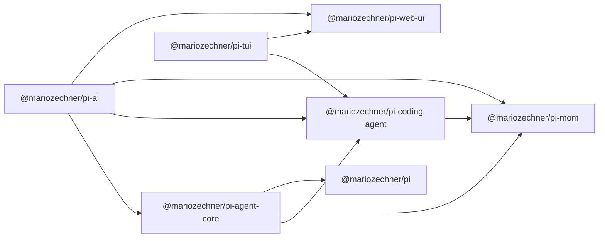
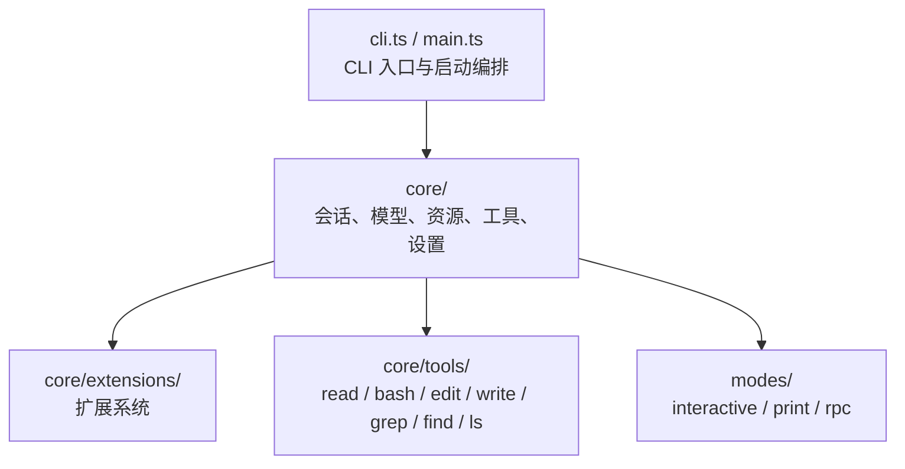
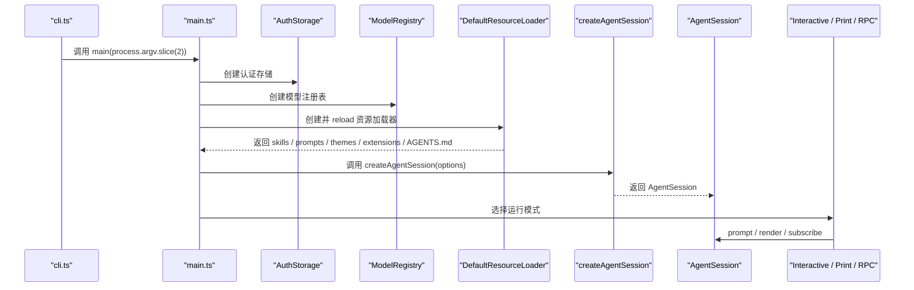
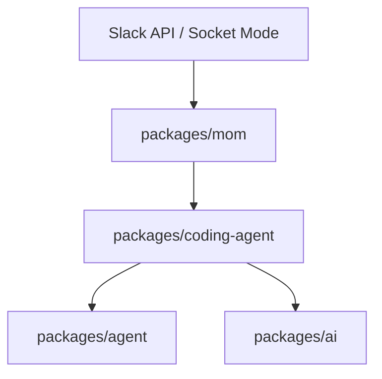

# Pi Monorepo 架构图与源码导读

这篇文档面向整个 `pi-mono` 仓库，解释各个包的职责、依赖关系、主运行时链路，以及为什么仓库会拆成现在这组模块。

从仓库根 README 和各包的 `package.json` 看，这个 monorepo 不是单体应用，而是一套围绕 agent 构建的分层工具箱：

- `packages/ai` 解决“如何与不同模型和 provider 交互”
- `packages/agent` 解决“如何让模型在消息、工具、状态之间形成 agent 循环”
- `packages/coding-agent` 解决“如何把这些能力包装成一个真正可用的 CLI 产品”
- `packages/mom`、`packages/web-ui`、`packages/pods` 是不同宿主或侧翼产品
- `packages/tui` 是终端交互体验的底座

## 仓库分层

可以把仓库理解成四层。

### 1. 模型与协议层

这一层是：

- `packages/ai`

它负责：

- provider 封装
- 模型列表和模型元数据
- 各类流式 API 适配
- tool call / thinking / usage / cost 等统一事件

源码与定义入口：

- [packages/ai/package.json](../packages/ai/package.json)

`@mariozechner/pi-ai` 的 `description` 是：

> Unified LLM API with automatic model discovery and provider configuration

所以它本质上是整仓库的 LLM 抽象层。

### 2. Agent 核心层

这一层是：

- `packages/agent`

它负责：

- agent loop
- 状态推进
- transport abstraction
- 工具调用的基本抽象

源码与定义入口：

- [packages/agent/package.json](../packages/agent/package.json)
- [packages/agent/src/index.ts](../packages/agent/src/index.ts)

`@mariozechner/pi-agent-core` 的 `description` 是：

> General-purpose agent with transport abstraction, state management, and attachment support

这说明它是通用 runtime，而不是专门为 coding agent 定制的壳层。

### 3. 交互与产品层

这一层包含：

- `packages/coding-agent`
- `packages/tui`
- `packages/web-ui`

其中：

- `packages/tui` 是终端 UI 组件库
- `packages/web-ui` 是 Web UI 组件库
- `packages/coding-agent` 是真正组合出产品体验的 CLI

源码与定义入口：

- [packages/tui/package.json](../packages/tui/package.json)
- [packages/web-ui/package.json](../packages/web-ui/package.json)
- [packages/coding-agent/package.json](../packages/coding-agent/package.json)

`@mariozechner/pi-coding-agent` 的 `description` 是：

> Coding agent CLI with read, bash, edit, write tools and session management

也就是说，`coding-agent` 是中枢产品层，而不是单纯 demo。

### 4. 集成与运维层

这一层包含：

- `packages/mom`
- `packages/pods`

其中：

- `mom` 是 Slack bot，复用 `coding-agent`
- `pods` 是模型部署和 GPU pod 管理 CLI

源码与定义入口：

- [packages/mom/package.json](../packages/mom/package.json)
- [packages/pods/package.json](../packages/pods/package.json)

## Monorepo 的包级依赖关系

下面这张图更接近源码和 `package.json` 中声明出来的依赖。

这张图的依据来自各包的 `dependencies`：

- [packages/agent/package.json](../packages/agent/package.json)
- [packages/coding-agent/package.json](../packages/coding-agent/package.json)
- [packages/mom/package.json](../packages/mom/package.json)
- [packages/web-ui/package.json](../packages/web-ui/package.json)
- [packages/pods/package.json](../packages/pods/package.json)

从依赖拓扑上能看出几个设计点：

1. `pi-ai` 是最基础的共用层，很多包直接依赖它。
2. `pi-agent-core` 构建在 `pi-ai` 之上，但仍然不绑定具体 UI。
3. `pi-coding-agent` 是“AI + agent + TUI + resources + tools”的聚合点。
4. `pi-mom` 不是重新发明一套 agent，而是直接复用 `pi-coding-agent`。
5. `pi-web-ui` 偏展示层，不依赖 `pi-agent-core`，更依赖 `pi-ai` 与 `pi-tui`。

## 根目录如何组织这些包

仓库根 `package.json` 使用 npm workspaces 管理所有包。

源码位置：

- [package.json](../package.json)

其中可以看到：

- `workspaces` 指向 `packages/*`
- 顶层 `build` 会按固定顺序构建：
  - `tui`
  - `ai`
  - `agent`
  - `coding-agent`
  - `mom`
  - `web-ui`
  - `pods`

这个顺序也暗示了依赖方向：

- 先构建基础库
- 再构建依赖这些基础库的产品层和集成层

## `coding-agent` 为什么是中枢

如果只选一个包作为这个仓库的“主应用”，那就是 `packages/coding-agent`。

原因不是 README 文案，而是它的源码位置和职责范围：

- CLI 入口在 [packages/coding-agent/src/cli.ts](../packages/coding-agent/src/cli.ts)
- 主启动流程在 [packages/coding-agent/src/main.ts](../packages/coding-agent/src/main.ts)
- 资源系统在 [packages/coding-agent/src/core/resource-loader.ts](../packages/coding-agent/src/core/resource-loader.ts)
- 会话系统在 [packages/coding-agent/src/core/agent-session.ts](../packages/coding-agent/src/core/agent-session.ts)

`main.ts` 顶部的注释已经写得很直白：

> Main entry point for the coding agent CLI.  
> This file handles CLI argument parsing and translates them into createAgentSession() options.  
> The SDK does the heavy lifting.

也就是说，`coding-agent` 做的事情不是“直接调模型然后打印结果”，而是：

- 组装模型、会话、设置、资源、工具
- 决定运行模式
- 创建 `AgentSession`
- 把后续控制权交给 session 和 mode 层

## `coding-agent` 内部的完整分层

可以把 `packages/coding-agent/src` 进一步拆成五块：

### CLI 入口层

入口文件：

- [packages/coding-agent/src/cli.ts](../packages/coding-agent/src/cli.ts)
- [packages/coding-agent/src/main.ts](../packages/coding-agent/src/main.ts)

职责：

- 解析参数
- 提前加载扩展，发现扩展注册的 CLI flags
- 创建 `AuthStorage`、`ModelRegistry`、`DefaultResourceLoader`
- 决定是 interactive、print、还是 RPC 模式

### 核心运行时层

关键文件：

- [packages/coding-agent/src/core/agent-session.ts](../packages/coding-agent/src/core/agent-session.ts)
- [packages/coding-agent/src/core/model-registry.ts](../packages/coding-agent/src/core/model-registry.ts)
- [packages/coding-agent/src/core/resource-loader.ts](../packages/coding-agent/src/core/resource-loader.ts)
- [packages/coding-agent/src/core/session-manager.ts](../packages/coding-agent/src/core/session-manager.ts)
- [packages/coding-agent/src/core/settings-manager.ts](../packages/coding-agent/src/core/settings-manager.ts)

职责：

- 维护当前会话和消息树
- 处理模型选择和 API key 解析
- 加载 skills、prompts、themes、extensions、AGENTS.md
- 组织工具与 system prompt
- 处理 compaction、retry、branching 等 session 行为

### 模式层

关键文件：

- [packages/coding-agent/src/modes/interactive/interactive-mode.ts](../packages/coding-agent/src/modes/interactive/interactive-mode.ts)
- [packages/coding-agent/src/modes/print-mode.ts](../packages/coding-agent/src/modes/print-mode.ts)
- [packages/coding-agent/src/modes/rpc/rpc-mode.ts](../packages/coding-agent/src/modes/rpc/rpc-mode.ts)

职责：

- 交互模式：终端 UI、slash command、selector、主题、消息渲染
- print 模式：单次执行并输出结果
- RPC 模式：通过 stdin/stdout 输出结构化事件

模式层不重写 agent 逻辑，它们只是不同的 I/O 适配器。

### 工具层

关键目录：

- [packages/coding-agent/src/core/tools](../packages/coding-agent/src/core/tools)

职责：

- `read`
- `bash`
- `edit`
- `write`
- `grep`
- `find`
- `ls`

这些工具是模型与本地文件系统、shell 环境交互的真正入口。

### 扩展与资源层

关键目录：

- [packages/coding-agent/src/core/extensions](../packages/coding-agent/src/core/extensions)
- [packages/coding-agent/src/core/skills.ts](../packages/coding-agent/src/core/skills.ts)
- [packages/coding-agent/src/core/prompt-templates.ts](../packages/coding-agent/src/core/prompt-templates.ts)

职责：

- extension：可执行 TypeScript 扩展点
- skill：按需加载的指令包
- prompt template：可展开的文本模板
- theme：UI 主题资源

这里体现的是“核心最小化，能力外置”的产品哲学。

## 一次 `coding-agent` 启动的主控制流

下面这张图描述 `pi` 启动到准备好接收用户输入的主链路。

这条链路的核心文件是：

- [packages/coding-agent/src/cli.ts](../packages/coding-agent/src/cli.ts)
- [packages/coding-agent/src/main.ts](../packages/coding-agent/src/main.ts)

## system prompt、项目上下文、skills 是怎么接进来的

`coding-agent` 的 prompt 不是一个固定字符串，而是动态组装出来的。

关键文件：

- [packages/coding-agent/src/core/system-prompt.ts](../packages/coding-agent/src/core/system-prompt.ts)
- [packages/coding-agent/src/core/resource-loader.ts](../packages/coding-agent/src/core/resource-loader.ts)

其组成通常包括：

1. 基础角色说明
2. 当前可用工具
3. 行为约束
4. `AGENTS.md` / `CLAUDE.md`
5. skills 元数据
6. 当前日期和工作目录

也就是说，项目上下文和 skill 不是会话外部的附加说明，而是模型 prompt 的正式组成部分。

## `skills`、`prompts`、`extensions` 在架构上的边界

这三者都属于“可扩展资源”，但职责不同。

### Skills

定义位置：

- [packages/coding-agent/src/core/skills.ts](../packages/coding-agent/src/core/skills.ts)

作用：

- 让模型按需加载某个 `SKILL.md`
- 把外部流程、脚本和参考资料包装成可复用能力

本质：

- 给模型看的说明书

### Prompt Templates

定义位置：

- [packages/coding-agent/src/core/prompt-templates.ts](../packages/coding-agent/src/core/prompt-templates.ts)

作用：

- 让用户用简短命令展开固定 prompt 模板

本质：

- 文本模板

### Extensions

定义位置：

- [packages/coding-agent/src/core/extensions](../packages/coding-agent/src/core/extensions)

作用：

- 注册工具
- 注册命令
- 注册 UI
- 注册事件处理器
- 改写 provider、运行方式和控制流

本质：

- 真正的运行时代码扩展

如果一个需求需要确定性行为和程序化控制，通常应该做成 extension，而不是 skill。

## `mom` 在整个架构里的位置

`mom` 不是独立设计的一套 bot 引擎，而是把 `coding-agent` 当作运行时核心嵌入到 Slack 场景。

最直接的证据在：

- [packages/mom/src/agent.ts](../packages/mom/src/agent.ts)

这里可以看到它直接从 `@mariozechner/pi-coding-agent` 导入：

- `AgentSession`
- `AuthStorage`
- `ModelRegistry`
- `SessionManager`
- `loadSkillsFromDir`
- `formatSkillsForPrompt`

这意味着 `mom` 的架构策略不是“复刻 coding-agent”，而是：

- 把 Slack 消息映射成 session prompt
- 复用 coding-agent 的资源体系、工具执行和会话体系
- 在外层补上 Slack、sandbox、workspace、memory、event 等宿主能力

可以把它看成：

## `pods` 在整个架构里的位置

`pods` 明显是另一条产品线：它不直接处理交互式 coding harness，而是管理远程模型部署。

关键入口：

- [packages/pods/src/cli.ts](../packages/pods/src/cli.ts)

从命令设计看，它负责：

- pod 管理
- vLLM 模型启动/停止
- SSH / shell
- 把远程模型暴露成可代理的 agent endpoint

它依赖 `@mariozechner/pi-agent-core`，但不依赖 `pi-coding-agent`。这说明它是一个更偏运维和基础设施的 CLI，而不是交互式 coding shell。

## `web-ui` 在整个架构里的位置

`web-ui` 负责把聊天能力和多模态文件展示带到 Web 环境。

定义入口：

- [packages/web-ui/package.json](../packages/web-ui/package.json)

它依赖：

- `@mariozechner/pi-ai`
- `@mariozechner/pi-tui`

这说明它不是简单的“把 coding-agent TUI 搬到浏览器”，而是单独抽了一层 Web component 组件库，直接建立在 `pi-ai` 和部分 UI 辅助能力之上。

所以它更像：

- 展示层 / 组件层
- 不直接拥有 `coding-agent` 的完整会话控制语义

## 为什么这个仓库要这样拆

从代码结构和包依赖看，这种拆分主要为了三件事。

### 1. 让基础能力可复用

如果把模型适配、agent loop、TUI、CLI 全塞在一个包里：

- Slack bot 很难复用
- Web UI 很难复用
- 部署管理 CLI 也很难共用基础能力

现在的拆法让：

- `ai` 可被多个宿主复用
- `agent` 可被多个产品层复用
- `coding-agent` 可被 `mom` 直接复用

### 2. 把“产品体验”和“底层协议”分开

例如：

- `pi-ai` 关心 provider、streaming、usage
- `pi-agent-core` 关心消息和工具循环
- `pi-coding-agent` 才关心 slash commands、session tree、skill、theme、interactive mode

这样每层都更聚焦。

### 3. 为扩展系统留出稳定边界

`coding-agent` 里的 resources、extensions、skills 并不是仓库边角功能，而是架构的一部分。

资源系统的存在让这个项目可以保持：

- 核心运行时较小
- 能力可以以 package、skill、prompt、extension 的方式外挂

这也是 README 里“aggressively extensible”那条产品哲学在代码结构里的体现。

## 从阅读源码的角度，推荐的入口顺序

如果你打算顺着代码读一遍，建议用这个顺序。

### 第一轮：看总入口

1. [README.md](../README.md)
2. [package.json](../package.json)
3. [packages/coding-agent/src/cli.ts](../packages/coding-agent/src/cli.ts)
4. [packages/coding-agent/src/main.ts](../packages/coding-agent/src/main.ts)

### 第二轮：看 `coding-agent` 核心

1. [packages/coding-agent/src/core/sdk.ts](../packages/coding-agent/src/core/sdk.ts)
2. [packages/coding-agent/src/core/agent-session.ts](../packages/coding-agent/src/core/agent-session.ts)
3. [packages/coding-agent/src/core/resource-loader.ts](../packages/coding-agent/src/core/resource-loader.ts)
4. [packages/coding-agent/src/core/model-registry.ts](../packages/coding-agent/src/core/model-registry.ts)
5. [packages/coding-agent/src/core/system-prompt.ts](../packages/coding-agent/src/core/system-prompt.ts)

### 第三轮：按功能看扩展能力

1. [packages/coding-agent/src/core/skills.ts](../packages/coding-agent/src/core/skills.ts)
2. [packages/coding-agent/src/core/prompt-templates.ts](../packages/coding-agent/src/core/prompt-templates.ts)
3. [packages/coding-agent/src/core/extensions](../packages/coding-agent/src/core/extensions)
4. [packages/coding-agent/src/core/tools](../packages/coding-agent/src/core/tools)

### 第四轮：看其他产品如何复用

1. [packages/mom/src/agent.ts](../packages/mom/src/agent.ts)
2. [packages/pods/src/cli.ts](../packages/pods/src/cli.ts)
3. [packages/web-ui/package.json](../packages/web-ui/package.json)

## 一句话总结

这个仓库的核心架构不是“一个 CLI 工具带几个辅助包”，而是：

> 用 `pi-ai` 和 `pi-agent-core` 打底，把 `pi-coding-agent` 做成中枢运行时，再把 Slack、Web、部署管理等不同产品形态挂在这套中枢和基础层之上。

如果你想继续往下拆，下一篇最值得写的是：

- `coding-agent` 的启动链路图
- `AgentSession` 的消息与工具调用时序图
- `resource-loader` 如何统一 skills / prompts / themes / extensions
