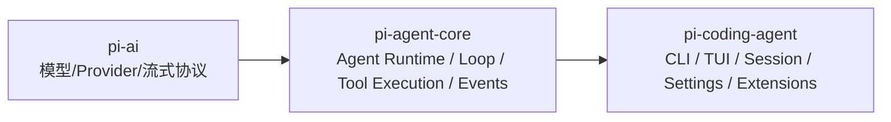
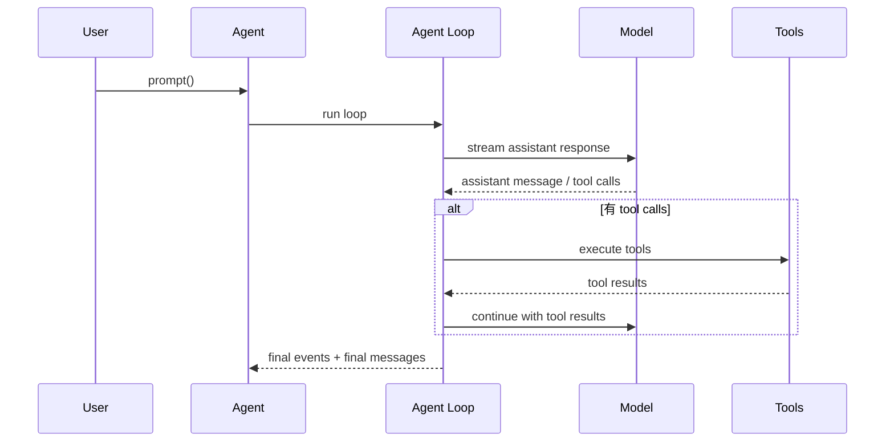

# pi-agent-core 架构说明

## 模块定位

`pi-agent-core` 是整个 `pi-mono` 里负责“让 agent 真正跑起来”的运行时内核。

它不直接解决多模型、多厂商接入，那是 `pi-ai` 的职责；它也不负责 CLI / TUI、session 持久化、settings、认证、扩展生态这些产品层能力，这些主要在 `pi-coding-agent`。

所以它的准确定位是：

> `pi-agent-core` 是一个有状态、事件驱动、支持 tool calling 的 agent runtime。

从整体分层来看：



简单说：

- `pi-ai` 负责“怎么调模型”
- `pi-agent-core` 负责“agent 怎么跑”
- `pi-coding-agent` 负责“怎么把 agent 做成产品”

---

## 它主要解决什么问题

`pi-agent-core` 主要解决的是“把一次 LLM 调用升级成一个可持续推进的 agent 执行过程”。

它承担的核心职责包括：

- 管理 agent 当前状态，包括消息历史、模型、工具、thinking level、streaming 状态
- 驱动多轮 agent loop，而不是只执行一次 completion
- 执行 assistant 产生的 tool calls，并把工具结果回灌给模型
- 对整个运行过程发出细粒度事件，供 UI、上层产品和调试系统消费
- 支持运行中控制，比如 `steer()`、`followUp()`、`abort()`

对应核心源码入口：

- `packages/agent/src/agent.ts`
- `packages/agent/src/agent-loop.ts`
- `packages/agent/src/types.ts`

---

## 它不负责什么

为了理解这个模块，必须同时明确它的边界。

`pi-agent-core` 不负责：

- session 持久化
- TUI / Web UI
- settings 和 auth 管理
- 产品级工具集合
- 扩展系统
- 业务流程编排

这说明它是一个 runtime kernel，而不是一个完整产品框架。

这种边界设计是合理的，因为它保持了通用性，既可以支撑 `pi-coding-agent`，也可以被别的 agent 产品复用。

---

## 核心抽象

### 1. Agent

`Agent` 是这个模块提供给上层最重要的主类。

你可以把它理解成：

> 一个带内部状态、可订阅事件、可驱动 agent loop 的控制器。

它对外提供的主要能力包括：

- `prompt()`
- `continue()`
- `subscribe()`
- `abort()`
- `waitForIdle()`
- `setModel()`
- `setTools()`
- `setThinkingLevel()`
- `steer()`
- `followUp()`

这些接口都集中在 `packages/agent/src/agent.ts`。

### 2. AgentState

`AgentState` 是运行时状态容器，定义在 `packages/agent/src/types.ts`。

关键字段包括：

- `systemPrompt`
- `model`
- `thinkingLevel`
- `tools`
- `messages`
- `isStreaming`
- `streamMessage`
- `pendingToolCalls`
- `error`

这说明 `pi-agent-core` 不是无状态的 request/response 包装层，而是一个真正的 stateful runtime。

其中最关键的几个点是：

- `messages` 保存上下文消息历史
- `streamMessage` 表示当前仍在流式生成中的 assistant message
- `pendingToolCalls` 表示当前仍在执行中的工具调用
- `isStreaming` 表示 agent 当前是否仍在工作

这套状态模型非常适合被 UI 层直接消费。

### 3. AgentMessage

`pi-agent-core` 内部使用的是 `AgentMessage`，而不是完全绑定 LLM 原生消息类型。

这意味着它内部可以承载：

- 标准 LLM 消息：`user`、`assistant`、`toolResult`
- 通过声明合并扩展出来的自定义消息类型

真正发给模型之前，会经过两步：

```text
AgentMessage[] -> transformContext() -> AgentMessage[] -> convertToLlm() -> Message[] -> LLM
```

- `transformContext()`：适合做裁剪、压缩、注入外部上下文
- `convertToLlm()`：把内部消息转换成模型真正能理解的格式

这个设计非常关键，因为它把“内部上下文丰富性”和“LLM 输入兼容性”解耦了。

### 4. AgentTool

`AgentTool` 是 `pi-agent-core` 里真正可执行的工具抽象。

它不仅有给模型看的 schema，还包含真正的 `execute()` 方法，返回：

- `content`
- `details`

所以它和 `pi-ai` 里的 tool 的区别可以理解成：

- `pi-ai` 更偏向 tool definition
- `pi-agent-core` 更偏向 executable tool

这也是它能承载真正 agent runtime 的关键。

---

## 运行模型

`pi-agent-core` 的核心不是单次 completion，而是一个 loop。

可以把它理解成下面这条链路：



一次标准 `prompt()` 通常包含这些阶段：

1. 接收用户输入并包装成 `user` message
2. 发出 `agent_start`
3. 进入一轮 `turn_start`
4. 流式请求模型生成 assistant message
5. 如果 assistant 中包含 tool calls，则执行工具
6. 工具结果以 `toolResult` message 的形式回到上下文
7. 继续下一轮 loop
8. 没有更多工具调用后，发出 `turn_end`
9. 所有 follow-up 也处理完成后，发出 `agent_end`

这说明 `pi-agent-core` 真正负责的是 agent execution semantics，而不是单次 API 调用。

---

## 事件流设计

事件流是 `pi-agent-core` 最重要的设计之一。

它把整个执行过程拆成稳定、细粒度、可观测的事件序列，常见事件包括：

- `agent_start`
- `agent_end`
- `turn_start`
- `turn_end`
- `message_start`
- `message_update`
- `message_end`
- `tool_execution_start`
- `tool_execution_update`
- `tool_execution_end`

这些事件的价值在于：

- UI 可以做增量渲染
- 上层产品可以订阅运行过程
- 调试系统能观察到每个阶段
- 审计和日志系统可以拿到更清晰的边界

这里有几个容易讲错但很重要的点：

- `message_update` 主要针对 assistant streaming
- `turn_end` 表示一轮结束，不代表整个 agent 完成
- `agent_end` 才表示本次 agent 执行真正结束

如果你要给别人讲这个模块，事件流通常是最容易建立理解的切入口。

---

## 工具执行机制

工具执行是 `pi-agent-core` 的核心能力之一。

当 assistant message 里出现 tool calls 时，它会执行下面的链路：

1. 找到匹配的工具
2. 校验参数
3. 调用 `beforeToolCall`
4. 执行工具
5. 在执行过程中发出 `tool_execution_update`
6. 调用 `afterToolCall`
7. 发出 `tool_execution_end`
8. 生成 `toolResult` message
9. 继续下一轮模型调用

### beforeToolCall

这个 hook 适合做：

- 权限检查
- 风险拦截
- 参数审计
- 黑名单限制

### afterToolCall

这个 hook 适合做：

- 结果清洗
- 结果增强
- 审计信息补充
- 统一错误包装

这两个 hook 让 `pi-agent-core` 不只是能执行工具，还能被上层产品治理。

---

## 并发模型

`pi-agent-core` 支持两种工具执行模式：

- `sequential`
- `parallel`

`parallel` 不是简单粗暴地全部并发，而是：

- 先顺序完成 preflight
- 再并发执行允许执行的工具
- 最终结果和事件仍然按 assistant 原始 tool call 顺序回放

这个设计很重要，因为它兼顾了：

- 性能
- 事件顺序稳定
- UI 可预测性
- 更安全的工具治理

这也是这个模块相对成熟的地方之一。

---

## Steering 与 Follow-up

这是 `pi-agent-core` 很有特点的一组能力，尤其适合交互式产品。

### Steering

作用是：

> 在 agent 已经开始运行时，插入一条重新引导后续方向的消息。

它不会硬中断已经开始执行的工具，但会在当前工具执行结束后、下一次 LLM 调用前注入。

### Follow-up

作用是：

> 在当前 agent 工作完成之后，再排入一条后续消息。

也就是说：

- `steer()` 更像中途改方向
- `followUp()` 更像排队处理下一件事

这两个能力让 `pi-agent-core` 很适合支撑 CLI / TUI 类交互式 agent 产品。

---

## 高层 API 与底层 API

这个模块其实提供了两层接口。

### 高层：Agent

适合：

- 产品开发
- 交互式应用
- 需要完整状态管理和事件订阅的场景

优点是：

- 易用
- 状态语义完整
- 屏障语义更稳定

### 低层：agentLoop / agentLoopContinue

适合：

- 自己定制运行时编排
- 想直接消费事件流
- 不想依赖 `Agent` 封装

但一般来说，对上层产品开发，优先用 `Agent` 更稳，因为它把更多运行时细节收住了。

---

## 在整个 pi-mono 中的角色

如果从整个 monorepo 看，`pi-agent-core` 处在非常关键的中间层。

向下：

- 依赖 `pi-ai`
- 复用模型调用、Provider 适配和流式协议

向上：

- 被 `pi-coding-agent` 使用
- 支撑 session 运行、工具调用、交互模式和产品级行为

所以它可以被看作：

> 整个 `pi-mono` 里的 agent runtime kernel

它不是纯 SDK，也不是 UI 框架，而是“agent 是怎么被执行”的那层语义承载层。

---

## 这个模块的设计优点

从架构角度看，`pi-agent-core` 的优点主要有这些：

- 分层清晰：和 `pi-ai`、`pi-coding-agent` 的边界明确
- 抽象合理：`Agent`、`AgentState`、`AgentMessage`、`AgentTool` 各司其职
- 事件细粒度：非常适合 UI、调试、审计和观测
- 工具执行链完整：校验、前置钩子、执行、后置钩子、结果回灌
- 并发模型成熟：不是粗暴并发，而是兼顾顺序和性能
- 对交互式产品友好：`steer()` 和 `followUp()` 很有产品价值

---

## 这个模块的局限

同样，从架构角度也要讲清楚它的局限：

- 不内置持久化
- 不管理 settings / auth
- 不内置产品级工具集合
- 不承载复杂工作流实体，比如 plan、todo、session tree
- 不直接解决业务治理，需要上层接 hook 和扩展逻辑

所以它的定位不是 full platform，而是一个非常强的 runtime core。

---

## 对外分享时的推荐讲法

如果你要给别人介绍整个系统，推荐按下面这个顺序讲：

1. 先讲分层
   `pi-ai` 是模型调用层，`pi-agent-core` 是 agent runtime 层，`pi-coding-agent` 是产品层。

2. 再讲一句话定义
   `pi-agent-core` 是一个有状态、事件驱动、支持 tool calling 的 agent 执行内核。

3. 再讲四个核心抽象
   `Agent`、`AgentState`、`AgentMessage`、`AgentTool`

4. 再讲主循环
   `prompt -> model -> tool -> toolResult -> next turn`

5. 最后讲它的价值
   事件流、并发工具执行、steering/follow-up，以及和产品层的清晰边界

---

## 一句话总结

`pi-agent-core` 是 `pi-mono` 里负责“agent 怎么跑”的那一层：它在 `pi-ai` 之上提供有状态上下文、多轮 loop、工具执行、事件流以及运行时控制能力，是整个 `pi-coding-agent` 产品层的运行时内核。
