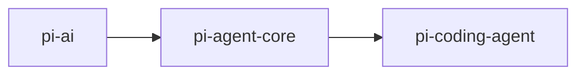
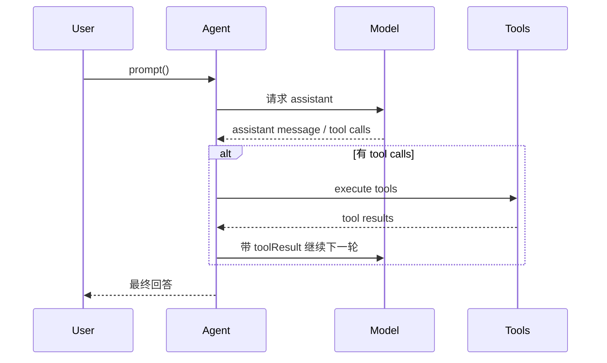

# pi-agent-core 分享讲稿

## 使用方式

这份文档适合你在做架构分享时直接使用。

每一页都包含：

- 页面标题
- 页面上建议展示的要点
- 讲解时可以直接说的讲稿

建议总时长：

- 简版：8 到 10 分钟
- 标准版：12 到 15 分钟

---

## 第 1 页：整体定位

### 页面标题

`pi-agent-core 是什么`

### 页面内容

- `pi-ai`：负责模型与 Provider 调用
- `pi-agent-core`：负责 agent runtime
- `pi-coding-agent`：负责产品层能力



### 讲稿

如果只用一句话介绍 `pi-agent-core`，我会说它是整个 `pi-mono` 里负责“让 agent 真正跑起来”的内核层。  
`pi-ai` 解决的是“怎么调模型”，`pi-coding-agent` 解决的是“怎么把 agent 做成产品”，而 `pi-agent-core` 处在两者中间，专门负责 agent runtime。

---

## 第 2 页：核心职责

### 页面标题

`它解决什么问题`

### 页面内容

- 管理 agent 状态
- 驱动多轮 agent loop
- 执行 tool calls
- 产出事件流
- 支持运行时控制

### 讲稿

`pi-agent-core` 不是单次 completion 包装器，它的核心价值是把一次模型调用升级成一个可持续推进的 agent 执行过程。  
它既要知道当前上下文是什么，也要知道工具怎么执行、下一轮什么时候开始、整个过程如何被 UI 或上层系统观察到。

---

## 第 3 页：边界

### 页面标题

`它不负责什么`

### 页面内容

- 不做 session 持久化
- 不做 TUI / Web UI
- 不做 settings / auth 管理
- 不做产品级工具集合
- 不做扩展生态本身

### 讲稿

理解这个模块最重要的一点，是同时理解它的边界。  
它不是完整产品框架，而是 runtime kernel。  
这种边界让它保持通用，也让上层 `pi-coding-agent` 可以自由地叠加 CLI、session、settings、extensions 等能力。

---

## 第 4 页：四个核心抽象

### 页面标题

`核心抽象`

### 页面内容

- `Agent`
- `AgentState`
- `AgentMessage`
- `AgentTool`

### 讲稿

这个模块最值得记住的是 4 个核心抽象。  
`Agent` 是主控制器，`AgentState` 是运行时状态，`AgentMessage` 是内部上下文消息抽象，`AgentTool` 是真正可执行的工具抽象。  
理解这 4 个对象，基本就理解了 `pi-agent-core` 的设计骨架。

---

## 第 5 页：Agent 与 State

### 页面标题

`Agent 如何承载运行时`

### 页面内容

- `prompt()`
- `continue()`
- `subscribe()`
- `steer()`
- `followUp()`
- `abort()`

状态字段示意：

- `messages`
- `tools`
- `model`
- `streamMessage`
- `pendingToolCalls`
- `isStreaming`

### 讲稿

`Agent` 可以理解成一个带内部状态的控制器。  
它不是无状态 API，而是持有 `messages`、`tools`、`model`、`pendingToolCalls` 这些状态。  
这意味着它不仅能发起一次 prompt，也能在中途被 steer、被 follow-up、被中断，还能让 UI 随时读取当前运行态。

---

## 第 6 页：消息模型

### 页面标题

`为什么不是直接用 LLM Message`

### 页面内容

消息转换链路：

```text
AgentMessage[] -> transformContext() -> AgentMessage[] -> convertToLlm() -> Message[] -> LLM
```

- `transformContext()`：裁剪、压缩、注入上下文
- `convertToLlm()`：转换成模型真实输入

### 讲稿

`pi-agent-core` 内部并不强行把自己限制在模型原生消息格式里。  
它先用更通用的 `AgentMessage` 承载内部上下文，再在真正调用模型前通过 `transformContext()` 和 `convertToLlm()` 做转换。  
这让它非常适合接入产品层自己的消息类型，而不会被 LLM 协议绑死。

---

## 第 7 页：主循环

### 页面标题

`一次 prompt 是怎么跑完的`

### 页面内容



### 讲稿

`pi-agent-core` 的核心不是单次 completion，而是 loop。  
用户发起 prompt 后，模型先给出 assistant message；如果里面有 tool calls，就执行工具，把工具结果重新回到上下文，再继续下一轮。  
直到没有更多工具调用，整轮 agent 才结束。

---

## 第 8 页：事件流

### 页面标题

`为什么它适合支撑 UI`

### 页面内容

- `agent_start` / `agent_end`
- `turn_start` / `turn_end`
- `message_start` / `message_update` / `message_end`
- `tool_execution_start` / `tool_execution_update` / `tool_execution_end`

### 讲稿

`pi-agent-core` 把整个执行过程拆成了细粒度事件流，这点非常关键。  
因为对 UI 来说，最重要的不是“最后得到什么”，而是“运行过程能不能被稳定观察和渲染”。  
这套事件流让 TUI、日志、调试、审计都能建立在同一套 runtime 语义上。

---

## 第 9 页：工具执行与并发

### 页面标题

`Tool Calling 是怎么治理的`

### 页面内容

- 支持 `sequential`
- 支持 `parallel`
- 有 `beforeToolCall`
- 有 `afterToolCall`

### 讲稿

这个模块不只是“能调工具”，更重要的是“能治理工具执行”。  
它支持串行和并行两种执行模式，并且提供前后置 hook。  
所以你可以在这里做权限控制、风险拦截、参数审计、结果清洗。  
这也是它为什么适合作为产品级 agent runtime 内核，而不是实验性 demo 代码。

---

## 第 10 页：Steering 与 Follow-up

### 页面标题

`为什么它适合交互式 Agent`

### 页面内容

- `steer()`：运行中改方向
- `followUp()`：当前工作完成后继续排队

### 讲稿

这是 `pi-agent-core` 很有特色的一组能力。  
`steer()` 允许在 agent 运行过程中重新引导它，`followUp()` 允许把下一件事排进队列。  
这两个能力对交互式 CLI/TUI 很关键，因为真实使用里，用户经常会中途补充信息、修正方向、追加任务。

---

## 第 11 页：它在整个系统里的价值

### 页面标题

`为什么这个模块关键`

### 页面内容

- 它承接 `pi-ai`
- 它支撑 `pi-coding-agent`
- 它定义了整个系统的 agent runtime 语义

### 讲稿

如果从整个 `pi-mono` 看，`pi-agent-core` 是非常关键的中间层。  
向下它复用 `pi-ai` 的模型能力，向上它支撑 `pi-coding-agent` 的产品能力。  
可以说，它定义了整个系统里“agent 是怎么运行”的基本语义。

---

## 第 12 页：总结

### 页面标题

`一句话总结`

### 页面内容

> `pi-agent-core` 是 `pi-mono` 中负责 agent runtime 的执行内核：它提供有状态上下文、多轮 loop、tool execution、事件流，以及运行时控制能力。

### 讲稿

最后总结一下，`pi-agent-core` 的价值不在于它能调用某个模型，而在于它把模型调用升级成了一个完整、可控、可观测、可扩展的 agent runtime。  
这也是它在整个 `pi-mono` 架构里最核心的意义。

---

## 分享建议

如果你现场分享，建议这样控制节奏：

- 先用第 1 到 3 页讲清楚定位和边界
- 再用第 4 到 7 页讲清楚核心结构和主流程
- 再用第 8 到 10 页讲事件流、工具治理和交互控制
- 最后用第 11 到 12 页收束到系统价值

如果听众偏工程实现，就多展开第 7、8、9 页。  
如果听众偏系统设计，就多展开第 1、2、3、11 页。
