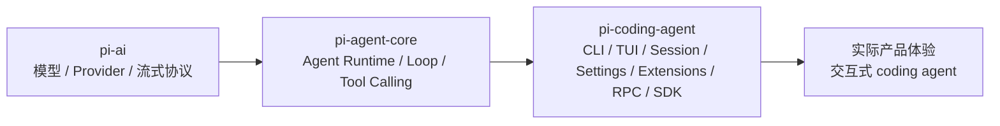
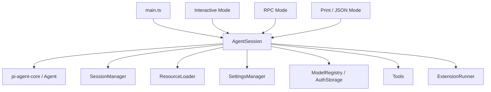
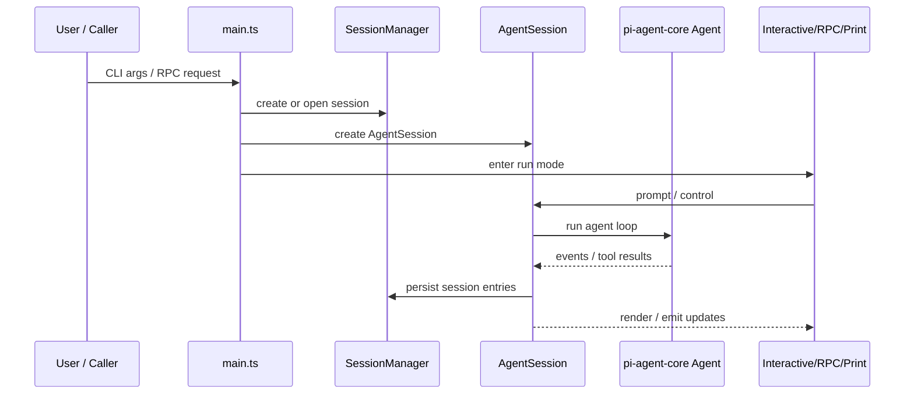

# pi-coding-agent 架构说明

## 模块定位

`pi-coding-agent` 是整个 `pi-mono` 里最接近“成品应用”的那一层。

如果说：

- `pi-ai` 负责模型和 Provider 调用
- `pi-agent-core` 负责 agent runtime

那么 `pi-coding-agent` 负责的就是：

> 把底层模型能力和 agent runtime 组织成一个真正可用的 coding agent 产品。

它不是单纯的 CLI 包装器，也不只是一个 TUI 外壳。  
它真正做的是把这些能力串起来：

- 命令行入口和参数体系
- 会话创建、恢复、分支、压缩和持久化
- 内置 coding tools
- provider / model / auth / settings 管理
- 交互式终端模式
- RPC 模式
- SDK 嵌入能力
- 扩展、skills、prompt templates、themes、packages 资源体系

从整体分层看：

一句话讲清楚它的定位：

> `pi-coding-agent` 是 `pi-agent-core` 之上的产品编排层。

---

## 它主要解决什么问题

`pi-coding-agent` 主要解决的是：

> 如何把一个通用 agent runtime 变成一个能长期做真实 coding 任务的产品系统。

它承担的核心职责包括：

- 提供真正面向用户的运行入口
- 管理 session 生命周期
- 把工具、模型、上下文和会话组合成完整工作流
- 把底层事件转成 TUI、RPC、Print、SDK 等不同使用方式
- 提供可扩展的产品能力装配点

对应最关键的源码入口：

- `packages/coding-agent/src/main.ts`
- `packages/coding-agent/src/core/agent-session.ts`
- `packages/coding-agent/src/core/session-manager.ts`
- `packages/coding-agent/src/cli/args.ts`
- `packages/coding-agent/src/modes/interactive/interactive-mode.ts`

---

## 它不负责什么

为了理解 `pi-coding-agent`，同样要先明确它的边界。

它不负责：

- 最底层模型调用协议和 Provider 适配，那是 `pi-ai`
- agent loop 语义本身，那是 `pi-agent-core`
- 终端 UI 基础组件库，那主要在 `pi-tui`
- 通用 Web 聊天 UI，那主要在 `packages/web-ui`
- 多子 agent 编排框架，README 也明确说明没有内置 sub-agents

所以它不是：

- LLM SDK
- 纯 UI 库
- 多 agent orchestration framework

而是一个面向 coding 场景的 agent product shell。

---

## 它在整个 pi-mono 中的位置

从主链路看，可以这样理解：

1. `pi-ai`
   负责把不同模型调用统一成一套接口

2. `pi-agent-core`
   负责把模型调用提升成一个支持工具和事件的 agent runtime

3. `pi-coding-agent`
   负责把 runtime 组织成一个真正可交互、可恢复、可扩展、可产品化的 coding agent

所以你学习 `pi-coding-agent` 时，最好的心智模型是：

> 它是产品层，不是底层模型层，也不是单纯 UI 层。

---

## 核心模块

## 1. 入口层：main.ts

`packages/coding-agent/src/main.ts` 是整个应用的总入口。

它的主要职责不是具体业务本身，而是总装配和模式分发：

- 解析 CLI 参数
- 提前加载 extensions 和资源
- 让扩展有机会注册 provider、flag、command 和行为
- 初始化 settings、auth、model registry、resource loader、session manager
- 构建 `AgentSession`
- 决定进入哪种运行模式

可以把它理解成：

> 应用级 bootstrapper 和 runtime assembler

它最关键的设计点有三个：

- 参数解析是分阶段的  
  先解析基础参数，再加载扩展，再让扩展补充 flag，最后重新解析。

- 扩展加载很早  
  因为 provider、model、commands 都可能来自扩展。

- 运行模式共用同一套初始化骨架  
  interactive、print、json、rpc 本质上共享同一个底层 session/runtime 基础。

---

## 2. 应用核心：AgentSession

`packages/coding-agent/src/core/agent-session.ts` 是这个包真正的核心。

它的角色不是“单纯的会话对象”，而更像：

> 一个面向产品场景的 agent orchestration controller

它做的事情非常多：

- 持有底层 `Agent`
- 接住 `SessionManager`
- 管理 prompt、continue、retry、compact、switch、fork、tree traversal
- 订阅 agent 事件并同步写入 session
- 管理 active tools、model、thinking level、system prompt
- 处理 bash 执行和工具相关产品行为
- 挂接 extension runner
- 为 interactive mode、rpc mode、print mode 暴露稳定接口

从架构上看，它处在整个系统的中枢位置：

如果只允许记住一个类，基本就是 `AgentSession`。

---

## 3. 持久化核心：SessionManager

`packages/coding-agent/src/core/session-manager.ts` 定义了 `pi-coding-agent` 的 session 数据模型。

它的核心思想是：

- 一个 session 对应一个 `.jsonl` 文件
- 文件里按行保存结构化 entry
- entry 之间通过 `id` 和 `parentId` 形成树，而不只是简单线性聊天记录

它负责：

- 创建 session
- 打开已有 session
- 继续最近 session
- fork 会话
- 遍历 session tree
- 记录消息、模型变化、thinking level、标签、压缩结果、自定义条目
- 从当前 leaf 重建上下文

所以 `SessionManager` 不是“文件读写工具”，而是：

> `pi-coding-agent` 的会话数据模型实现

这也是它和很多简单 AI CLI 的根本区别之一。  
这里的 session 不是一次聊天，而是一个可恢复、可分支、可压缩、可追踪的长期工作空间。

---

## 4. CLI 合同：args.ts

`packages/coding-agent/src/cli/args.ts` 是这个产品的 CLI 能力面定义。

它回答的是一个很实用的问题：

> 用户真正能从命令行层面使用哪些能力？

它覆盖的内容包括：

- provider / model / thinking level
- session 相关参数
- mode 相关参数
- tools / resources / extensions / prompts / themes
- print / json / rpc / interactive 选择

从学习角度讲，`args.ts` 很适合拿来快速建立产品地图。  
很多时候先看这里，比一开始就扎进实现细节更有效。

---

## 5. 交互层：interactive-mode.ts

`packages/coding-agent/src/modes/interactive/interactive-mode.ts` 是 TUI 层入口。

它的职责不是重新实现业务逻辑，而是：

> 把 `AgentSession` 的能力渲染成可操作的交互终端产品。

它主要负责：

- 聊天区、输入区、页脚等界面组织
- slash commands
- 自动补全
- model / session / settings 选择器
- 工具调用结果渲染
- bash 结果展示
- 键盘交互和焦点管理

要特别注意一个认识：

> interactive mode 不是 agent 本体，它只是 `AgentSession` 的表现层。

所以排查问题时，最好先区分：

- 这是 runtime / session 问题
- 还是纯 UI 呈现问题

---

## 一次运行的主流程

从产品执行链路看，一次 `pi-coding-agent` 运行大致经历这些阶段：

1. 解析命令行参数
2. 加载资源和 extensions
3. 初始化 settings、auth、model registry、resource loader
4. 创建或恢复 `SessionManager`
5. 构造 `AgentSession`
6. 根据模式进入 interactive / print / json / rpc
7. `AgentSession` 驱动底层 `Agent`
8. 运行中的消息、事件、模型变化、压缩结果等写入 session 文件
9. TUI 或 RPC 持续消费这些状态

可以用一张图理解：

这说明它不是“调一次模型然后打印结果”，而是一个完整的运行时产品壳。

---

## 最重要的产品能力

## 1. Session 是一等公民

这是 `pi-coding-agent` 最核心的产品设计之一。

在这里，会话不是临时内存，而是有结构、有分支、可恢复的工作实体。

它的价值在于：

- 支持长任务
- 支持中断后恢复
- 支持回到历史节点重新分支
- 支持 compact 继续做长期任务
- 支持把模型变化、thinking level 变化也纳入可追踪上下文

从本质上说：

> session 是 coding agent 的工作记忆层

---

## 2. 工具是产品能力的基础

`pi-agent-core` 只提供工具调用机制，但 `pi-coding-agent` 真正把 coding 场景需要的工具组织好了。

典型包括：

- `read`
- `write`
- `edit`
- `bash`
- `grep`
- `find`
- `ls`

这意味着它不是抽象的聊天 agent，而是能对真实代码库动手的 agent。

因此很多产品行为必须在这一层解决，比如：

- 文件修改顺序控制
- bash 执行管理
- 工具结果如何展示
- 工具输出如何写入 session

---

## 3. 扩展系统很重要

`pi-coding-agent` 的很多能力不是硬编码写死的，而是通过扩展机制注入。

扩展可以参与：

- provider 注册
- command 注册
- 资源发现
- 输入/工具/会话相关事件
- UI 增强

这说明它的设计理念不是“把所有能力都塞进核心”，而是：

> 核心保持稳定，产品能力尽量外放

这也是为什么 README 里会反复强调 extensions、skills、prompt templates 和 packages。

---

## 4. 它是多运行模式运行时

很多人第一次看容易把 `pi-coding-agent` 理解成“终端聊天工具”。

更准确的说法应该是：

- 它是一个交互式 CLI
- 它是一个可脚本化的 print / json 工具
- 它是一个可嵌入的 SDK
- 它是一个可被外部系统控制的 RPC runtime

所以它不是只服务于“人手动操作”，也服务于系统集成。

---

## 为什么 AgentSession 最关键

学习这个包时，最应该抓住的一点是：

> 真正把“用户输入、agent 运行、工具执行、session 落盘、扩展钩子、不同运行模式”串成产品链路的，是 `AgentSession`。

它向下接：

- `Agent`
- `SessionManager`
- tools
- model registry
- settings
- resource loader
- extension runner

它向上接：

- interactive mode
- rpc mode
- print / json mode
- sdk

这也是为什么很多问题最终都会汇聚到这里。

---

## Session 模型为什么有学习价值

`SessionManager` 值得单独重视，因为它体现了这个项目对长期 coding task 的理解。

它解决的不是“保存聊天记录”，而是：

- 如何从 append-only 文件恢复当前工作上下文
- 如何支持 fork 和 tree traversal
- 如何在不丢历史的前提下 compact
- 如何在长期任务里持续积累结构化工作轨迹

所以 session 模型可以理解成：

> coding agent 的长期记忆机制

而不是普通聊天日志。

---

## 设计优点

从架构角度看，`pi-coding-agent` 的优点主要有这些：

- 分层清晰：和 `pi-ai`、`pi-agent-core` 的边界明确
- `AgentSession` 中枢化：真正把产品层 orchestration 收敛到一个核心类
- session 模型很强：不是简单线性聊天，而是树状、可恢复、可压缩、可分支
- 运行模式统一：interactive、print、json、rpc、sdk 共用底层能力
- 扩展性强：provider、command、resources、behavior 都能外放
- 既适合人直接用，也适合集成进别的系统

---

## 边界和局限

同样，这个模块也有明确边界：

- 不内置 sub-agents
- session 文件层不是为多写者安全专门设计的
- 很多高级能力依赖 extension，而不是默认内建
- 真正复杂度不在 UI，而在 runtime orchestration 和 session 模型

这说明它更像一个“可扩展产品底座”，而不是什么都内置的超级平台。

---

## 对外分享时的推荐讲法

如果你要给别人介绍整个系统，推荐按下面顺序讲：

1. 先讲分层  
   `pi-ai` 是模型层，`pi-agent-core` 是 runtime 层，`pi-coding-agent` 是产品层。

2. 再讲一句话定义  
   `pi-coding-agent` 是把 `pi-agent-core` 做成真正 coding agent 产品的那一层。

3. 再讲 5 个核心模块  
   `main.ts`、`AgentSession`、`SessionManager`、`args.ts`、`interactive-mode.ts`

4. 再讲主流程  
   `CLI/RPC 输入 -> SessionManager -> AgentSession -> Agent -> session 持久化 -> UI/RPC 输出`

5. 最后讲它的产品价值  
   session 是一等公民、工具是真正可执行的、扩展系统很强、运行模式很多

---

## 一句话总结

`pi-coding-agent` 是 `pi-mono` 里负责“把 agent 做成产品”的那一层：它在 `pi-agent-core` 的 runtime 之上，补上了 session、tools、CLI/TUI、settings、auth、extensions、RPC 和 SDK，使整个系统从“能跑 agent”升级成“能长期做真实 coding 任务的产品框架”。
