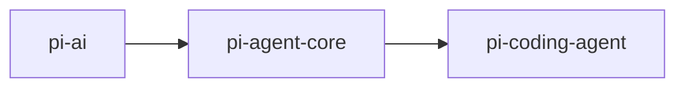
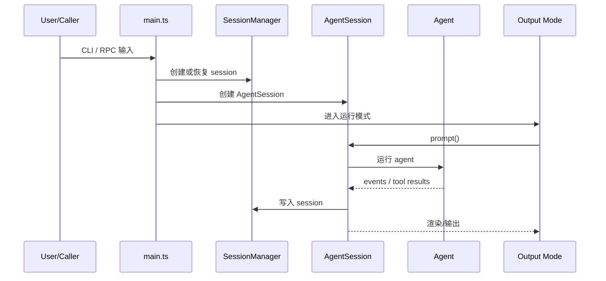

# pi-coding-agent 分享讲稿

## 使用方式

这份文档适合你在做系统架构分享时直接使用。

每一页包含：

- 页面标题
- 页面上建议展示的内容
- 可以直接口头讲的讲稿

建议时长：

- 简版：10 分钟
- 标准版：12 到 15 分钟

---

## 第 1 页：整体定位

### 页面标题

`pi-coding-agent 是什么`

### 页面内容

- `pi-ai`：模型层
- `pi-agent-core`：runtime 层
- `pi-coding-agent`：产品层

### 讲稿

如果只用一句话介绍 `pi-coding-agent`，我会说它是整个 `pi-mono` 里负责“把 agent 做成产品”的那一层。  
`pi-ai` 解决模型调用，`pi-agent-core` 解决 agent runtime，而 `pi-coding-agent` 解决真正交付给用户的应用体验。

---

## 第 2 页：它解决什么问题

### 页面标题

`它为什么存在`

### 页面内容

- 提供真正面向用户的入口
- 管理会话生命周期
- 组织工具、模型、上下文
- 提供 TUI / RPC / SDK / Print 多种运行方式
- 提供扩展装配能力

### 讲稿

`pi-coding-agent` 的核心不是再写一层聊天壳，而是把底层 runtime 组装成一个可长期工作的 coding agent 系统。  
它要解决的是：用户怎么进入系统、上下文怎么保存、工具怎么组织、不同模式怎么复用同一套内核。

---

## 第 3 页：边界

### 页面标题

`它不是什么`

### 页面内容

- 不是模型 SDK
- 不是纯终端 UI 库
- 不是多子 agent 编排框架
- 不是通用 Web 应用层

### 讲稿

理解 `pi-coding-agent` 最重要的一点，是不要把它误解成 UI 工具或者底层 SDK。  
它不是 `pi-ai`，也不是 `pi-tui`。  
它是一个产品编排层，重点在 orchestration，而不是单点能力。

---

## 第 4 页：五个核心模块

### 页面标题

`核心模块地图`

### 页面内容

- `main.ts`
- `AgentSession`
- `SessionManager`
- `args.ts`
- `interactive-mode.ts`

### 讲稿

如果你要快速建立对 `pi-coding-agent` 的整体认知，我建议直接记住 5 个核心模块。  
`main.ts` 是总入口，`AgentSession` 是产品核心调度层，`SessionManager` 是会话模型，`args.ts` 是 CLI 合同，`interactive-mode.ts` 是交互表现层。

---

## 第 5 页：main.ts

### 页面标题

`应用如何启动`

### 页面内容

- 参数解析
- 提前加载 extensions
- 初始化资源和配置
- 创建 session manager
- 创建 agent session
- 分发运行模式

### 讲稿

`main.ts` 更像一个应用启动器。  
它不是写业务逻辑的地方，而是负责把 settings、extensions、session、agent runtime、模式选择这些东西组装起来。  
它最重要的价值在于把不同模式统一到同一套初始化骨架上。

---

## 第 6 页：AgentSession

### 页面标题

`真正的产品中枢`

### 页面内容

- 向下接 `Agent`
- 向旁接 `SessionManager`
- 管理 prompt / retry / compact / switch / fork
- 管理 tools / model / extensions
- 向上服务 interactive / rpc / print / sdk

### 讲稿

`AgentSession` 是整个 `pi-coding-agent` 最关键的类。  
它不是普通 session 对象，而是产品层的 orchestration controller。  
真正把“用户输入、agent 运行、工具执行、session 落盘、扩展钩子、UI 输出”串起来的，就是这一层。

---

## 第 7 页：SessionManager

### 页面标题

`为什么 session 是一等公民`

### 页面内容

- 一个 session 一个 `.jsonl`
- entry 带 `id` / `parentId`
- 支持 tree / fork / resume / compact

### 讲稿

这是这个项目和很多简单 AI CLI 最大的差别之一。  
在这里 session 不是临时聊天记录，而是一个长期工作空间。  
它支持恢复、分支、压缩和树形遍历，所以更适合真实 coding task，而不是短对话。

---

## 第 8 页：运行主流程

### 页面标题

`一次请求是怎么走完的`

### 页面内容

### 讲稿

一次 `pi-coding-agent` 运行，不是“收一条 prompt，打一段回答”这么简单。  
它会先建立或恢复 session，再把请求交给 `AgentSession`，由 `AgentSession` 驱动底层 `Agent`，并把结果持续写入 session，同时把更新发给 TUI、RPC 或 print 模式。

---

## 第 9 页：工具与扩展

### 页面标题

`为什么它不是死板产品`

### 页面内容

- 内置 coding tools
- 支持 skills / prompts / themes / packages
- 扩展可以注册 provider / command / resource / behavior

### 讲稿

`pi-coding-agent` 虽然是产品层，但它不是写死的产品。  
它把很多能力外放给 extensions、skills、prompt templates 和 packages。  
所以你可以把它当成一个可扩展的产品底座，而不是一个封闭的 CLI 工具。

---

## 第 10 页：多运行模式

### 页面标题

`它不只是交互式终端`

### 页面内容

- Interactive mode
- Print / JSON mode
- RPC mode
- SDK mode

### 讲稿

很多人第一次看到它，会觉得它就是一个终端交互工具。  
其实它更像一个统一 runtime，对外暴露多种入口。  
人可以通过 interactive mode 使用，脚本可以通过 print/json 使用，外部系统可以通过 RPC 或 SDK 集成。

---

## 第 11 页：设计优点

### 页面标题

`这个模块为什么架构上不错`

### 页面内容

- 分层清晰
- `AgentSession` 中枢化
- session 模型强
- 多模式复用同一套内核
- 扩展性强

### 讲稿

从架构上看，`pi-coding-agent` 的优点在于它没有把所有复杂度散落到 UI、CLI、tools 各处。  
它把核心 orchestration 收敛到 `AgentSession`，再把 session、settings、extensions、modes 都围绕这个中枢组织起来，所以整体结构是比较清晰的。

---

## 第 12 页：总结

### 页面标题

`一句话总结`

### 页面内容

> `pi-coding-agent` 是 `pi-mono` 中把 `pi-agent-core` 产品化的那一层，它提供 session、tools、CLI/TUI、extensions、RPC 和 SDK，把通用 runtime 变成真正可用的 coding agent 产品。

### 讲稿

最后总结一下，`pi-coding-agent` 的价值不在于它实现了某个单点功能，而在于它把 runtime、session、工具、交互和扩展装配成了一个真正可用的应用层系统。  
如果说 `pi-agent-core` 回答的是“agent 怎么跑”，那 `pi-coding-agent` 回答的就是“agent 怎么被交付和使用”。

---

## 分享建议

如果你现场分享，建议这样控制节奏：

- 第 1 到 3 页先讲清楚分层和边界
- 第 4 到 8 页讲核心结构和主流程
- 第 9 到 10 页讲扩展性和多模式
- 第 11 到 12 页收束到架构价值

如果听众偏系统设计，就多讲第 1、2、7、11 页。  
如果听众偏实现细节，就多讲第 5、6、8、9 页。
