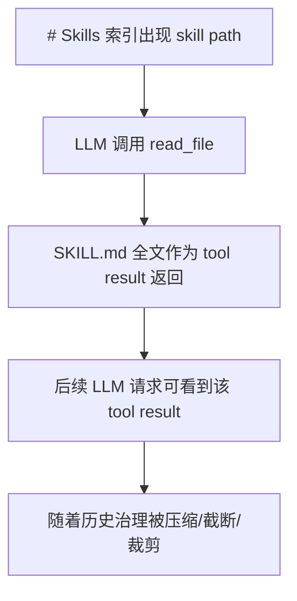

# Nanobot Skill 剔除与上下文消失机制分析

本文专门分析 nanobot 中 skill 在什么情况下会从上下文里消失。

这里的“消失”不是单一含义，需要分成几类：

1. skill 完全不进入系统提示词。
2. skill 从 `# Active Skills` 全文注入中消失，但仍保留在 `# Skills` 索引里。
3. skill 从 `# Skills` 索引中消失，但其实已经在 `# Active Skills` 中全文出现。
4. 普通 skill 被模型读取后，其 `SKILL.md` 全文作为 tool result 又被历史压缩、截断或裁剪掉。
5. subagent 中的 skill 注入策略与主 agent 不同。

核心文件：

- `nanobot/agent/skills.py`
- `nanobot/agent/context.py`
- `nanobot/agent/runner.py`
- `nanobot/agent/loop.py`
- `nanobot/agent/subagent.py`
- `nanobot/templates/agent/skills_section.md`

## 一、Skill 在系统提示词中的两种存在形态

主 agent 的 system prompt 中，skill 有两种形态：

```text
# Active Skills

### Skill: memory
...

---

# Skills

- **github** — ... `/path/to/SKILL.md`
- **tmux** — ... `/path/to/SKILL.md`
```

区别是：

- `# Active Skills`：全文注入，模型每次 LLM 请求都能直接看到。
- `# Skills`：只有索引，包含 name、description、path、availability。模型需要调用 `read_file` 读取完整 `SKILL.md`。

对应逻辑在 `ContextBuilder.build_system_prompt()`：

```python
always_skills = self.skills.get_always_skills()
if always_skills:
    always_content = self.skills.load_skills_for_context(always_skills)
    if always_content:
        parts.append(f"# Active Skills\n\n{always_content}")

skills_summary = self.skills.build_skills_summary(exclude=set(always_skills))
if skills_summary:
    parts.append(render_template("agent/skills_section.md", skills_summary=skills_summary))
```

因此分析“skill 消失”时，需要先问：它是从 Active 全文里消失，还是从 Skills 索引里消失，还是读过之后从历史里消失。

## 二、硬剔除：完全不进 skill 上下文

以下情况会让 skill 既不出现在 `# Active Skills`，也不出现在 `# Skills` 索引。

### 1. Skill 文件不可发现

`SkillsLoader` 只识别两类路径：

```text
<workspace>/skills/<skill-name>/SKILL.md
nanobot/nanobot/skills/<skill-name>/SKILL.md
```

发现逻辑只扫描直接子目录：

```python
for skill_dir in base.iterdir():
    if not skill_dir.is_dir():
        continue
    skill_file = skill_dir / "SKILL.md"
    if not skill_file.exists():
        continue
```

所以这些情况都会让 skill 消失：

- `skills/xxx/SKILL.md` 不存在。
- skill 放在更深层嵌套目录，比如 `skills/group/xxx/SKILL.md`。
- 文件名不是严格的 `SKILL.md`。
- 所在目录不存在。
- builtin skills 目录不存在或不可访问。

这不是运行时过滤，而是发现阶段根本没有产生 entry。

### 2. 被 `disabled_skills` 禁用

`disabled_skills` 是最明确的剔除机制。

`SkillsLoader.list_skills()` 在合并 workspace 和 builtin entries 后，会按名字过滤：

```python
if self.disabled_skills:
    skills = [s for s in skills if s["name"] not in self.disabled_skills]
```

这个过滤发生在统一列表层，所以影响很彻底：

- 普通 skill 不会进入 `# Skills`。
- always skill 不会进入 `# Active Skills`。
- subagent 的 skill summary 里也不会出现。

相关配置字段：

```python
disabled_skills: list[str] = Field(default_factory=list)
```

它会从 config defaults 传入 `AgentLoop`，再传给 `ContextBuilder` 和 `SubagentManager`。

### 3. Workspace 同名覆盖 builtin

workspace skill 的优先级高于 builtin skill。

`list_skills()` 先扫描 workspace：

```python
skills = self._skill_entries_from_dir(self.workspace_skills, "workspace")
workspace_names = {entry["name"] for entry in skills}
```

再扫描 builtin，但跳过 workspace 已有名字：

```python
skills.extend(
    self._skill_entries_from_dir(self.builtin_skills, "builtin", skip_names=workspace_names)
)
```

这意味着：

- 如果 workspace 有 `skills/github/SKILL.md`，builtin `github` 会消失。
- 如果 workspace 有 `skills/memory/SKILL.md`，builtin always skill `memory` 会消失。
- 如果 workspace 同名 skill 没有 `always: true`，那么原 builtin always skill 的全文注入效果也会消失。
- 如果 workspace 同名 skill 又被 `disabled_skills` 禁用，builtin 不会自动补回来，因为 builtin 在扫描时已经被 shadow 掉。

这是一种“替换式消失”，不是简单过滤。

## 三、从 Active Skills 消失，但仍留在 Skills 索引

这一类不是完全剔除，而是从“全文常驻”降级为“索引可见，按需读取”。

### 1. 没有 `always: true`

只有 `get_always_skills()` 命中的 skill 才会进入 `# Active Skills`。

判断逻辑：

```python
return [
    entry["name"]
    for entry in self.list_skills(filter_unavailable=True)
    if (meta := self.get_skill_metadata(entry["name"]) or {})
    and (
        self._parse_nanobot_metadata(meta.get("metadata")).get("always")
        or meta.get("always")
    )
]
```

所以：

- 没有 frontmatter 的 skill 不会进 Active。
- 有 frontmatter 但没有 `always: true` 不会进 Active。
- `metadata.nanobot.always` 不为 true 不会进 Active。
- YAML 解析失败导致 metadata 读不到，也不会进 Active。

但只要它被发现且未 disabled，仍会进入 `# Skills` 索引。

### 2. always skill 的依赖不满足

`get_always_skills()` 调用的是：

```python
self.list_skills(filter_unavailable=True)
```

也就是说，always skill 要想进入 Active，必须先通过 requirements 检查。

当前 requirements 只检查两类：

```python
requires = skill_meta.get("requires", {})
required_bins = requires.get("bins", [])
required_env_vars = requires.get("env", [])
return all(shutil.which(cmd) for cmd in required_bins) and all(
    os.environ.get(var) for var in required_env_vars
)
```

如果缺少 CLI 或环境变量：

- 它不会进 `# Active Skills`。
- 但它仍会进 `# Skills` 索引，因为 `build_skills_summary()` 使用 `filter_unavailable=False`。
- 索引里会标注 unavailable 原因。

示例：

```text
- **github** — Interact with GitHub using the `gh` CLI. (unavailable: CLI: gh) `/.../github/SKILL.md`
```

所以依赖不满足对 always skill 来说是“从全文注入剔除”，不是“从所有上下文剔除”。

### 3. `load_skill()` 读不到文件

`load_skills_for_context()` 里有这一层过滤：

```python
parts = [
    f"### Skill: {name}\n\n{self._strip_frontmatter(markdown)}"
    for name in skill_names
    if (markdown := self.load_skill(name))
]
```

如果 `get_always_skills()` 得到名字后，实际 `load_skill(name)` 返回空或 None，那么它不会被拼到 `# Active Skills`。

正常情况下这不常见，因为 always 名字来自已发现 skill；但如果文件在扫描和读取之间被删除，或者读文件失败，这里会让它从 Active 内容中消失。

## 四、从 Skills 索引消失，但其实在 Active Skills

这是一个“去重式消失”。

`ContextBuilder` 构造普通 skill summary 时，会排除 always skills：

```python
skills_summary = self.skills.build_skills_summary(exclude=set(always_skills))
```

`build_skills_summary()` 中对应逻辑：

```python
if exclude and skill_name in exclude:
    continue
```

所以：

- `memory` 在 `# Skills` 索引里消失，是因为它已经在 `# Active Skills` 全文出现。
- `my` 在 `# Skills` 索引里消失，也是同理。

这不是禁用，也不是不可用，而是避免重复注入。

## 五、普通 Skill 被读取后，从后续上下文消失

普通 skill 的全文不是 system prompt 的固定部分。它的生命周期通常是：



因此，普通 skill 的全文消失遵循 tool result 和历史消息的治理规则。

### 1. 被 microcompact 压缩

`read_file` 在 Runner 的 compactable tools 集合里：

```python
_COMPACTABLE_TOOLS = frozenset({
    "read_file", "exec", "grep", "find_files",
    "web_search", "web_fetch", "list_dir", "list_exec_sessions",
})
```

`_microcompact()` 会保留最近若干个 compactable tool result，较旧且较大的结果会被替换为：

```text
[read_file result omitted from context]
```

对应逻辑：

```python
if msg.get("role") == "tool" and msg.get("name") in _COMPACTABLE_TOOLS:
    compactable_indices.append(idx)
...
summary = f"[{name} result omitted from context]"
updated[idx]["content"] = summary
```

这意味着：模型读过普通 `SKILL.md` 后，那份全文并不保证长期留在上下文里。它可能变成一行 omitted summary。

### 2. 被 context window 裁剪

每轮发给 provider 前，Runner 会执行 `_snip_history()`。

它会保留 system messages，然后在剩余 token 预算内从尾部保留 non-system messages：

```python
system_messages = [dict(msg) for msg in messages if msg.get("role") == "system"]
non_system = [dict(msg) for msg in messages if msg.get("role") != "system"]
...
for message in reversed(non_system):
    msg_tokens = estimate_message_tokens(message)
    if kept and kept_tokens + msg_tokens > remaining_budget:
        break
    kept.append(message)
```

普通 `SKILL.md` 全文如果只是一个旧的 `read_file` tool result，那么它属于 non-system history。上下文紧张时，它可能被整条裁掉。

### 3. 保存 session 时被截断

`read_file` 在 Runner 的 generic offload/truncation 中被豁免：

```python
_TOOL_RESULT_OFFLOAD_EXEMPT_TOOLS = frozenset({"read_file"})
```

但保存到 session 时，`AgentLoop._save_turn()` 仍会对过大的 tool content 做截断：

```python
if role == "tool":
    if isinstance(content, str) and len(content) > self.max_tool_result_chars:
        entry["content"] = truncate_text_fn(content, self.max_tool_result_chars)
```

因此很长的 `SKILL.md` 读取结果可能在持久化历史中被截断。

### 4. Session replay 不一定回放旧 tool result

即使 tool result 还在 session 文件中，`Session.get_history()` 也会按：

- `max_messages`
- `max_tokens`
- `last_consolidated`
- legal message boundary

决定本次实际回放哪些历史。

如果读 skill 的那轮已经很旧，它可能根本不进入 `history`，从而不出现在本次 LLM 输入里。

### 5. Memory/Dream 整理不会让普通 skill 全文常驻

Dream 可以创建或维护 `skills/<name>/SKILL.md`，但这并不意味着该 skill 全文会自动常驻主 agent 上下文。

除非该 skill 是 `always: true` 且 requirements 满足，否则它仍然只是普通索引项，需要模型按需读取。

## 六、Subagent 中的特殊剔除现象

subagent 的 prompt 与主 agent 不一样。

`SubagentManager._build_subagent_prompt()` 只调用：

```python
skills_summary = SkillsLoader(
    root,
    disabled_skills=self.disabled_skills,
).build_skills_summary()
```

它没有主 agent 的：

```python
get_always_skills()
load_skills_for_context(always_skills)
```

所以从 subagent 视角看：

- always skill 不会作为 `# Active Skills` 全文出现。
- 所有可见 skill 都以 summary/index 方式出现。
- subagent 若要使用 skill，需要自己调用 `read_file`。
- `disabled_skills` 仍然有效，会让对应 skill 从 subagent summary 中消失。

这是一种 prompt 策略差异，不是 bug。

## 七、不同“消失”的判定表

| 情况 | Active Skills | Skills 索引 | 说明 |
|------|---------------|-------------|------|
| 没有 `SKILL.md` | 消失 | 消失 | 发现阶段失败 |
| 非直接子目录 | 消失 | 消失 | loader 不递归扫描 |
| 被 `disabled_skills` 禁用 | 消失 | 消失 | 硬过滤 |
| workspace 同名覆盖 builtin | builtin 消失 | builtin 消失 | workspace 版本替代 |
| 非 `always` skill | 消失 | 保留 | 普通按需读取 |
| always 但缺 bin/env | 消失 | 保留，标注 unavailable | Active 要求可用，summary 不过滤不可用 |
| always 且可用 | 保留 | 消失 | 被 summary exclude 去重 |
| YAML metadata 解析失败 | 消失 | 通常保留 | 无法识别 always/description |
| `read_file` 读过普通 skill 很久以后 | 不适用 | 索引仍可能保留 | 全文 tool result 可能被压缩/裁剪 |
| subagent prompt | 不注入 | 保留 summary | subagent 没有 Active Skills 全文注入 |

## 八、几个容易踩坑的点

### 1. unavailable 不等于 invisible

普通 summary 使用 `filter_unavailable=False`。所以缺依赖的 skill 仍然可见，只是标注 unavailable。

只有 `get_always_skills()` 使用 `filter_unavailable=True`，所以缺依赖主要影响 Active 全文注入。

### 2. disabled 比 requirements 更强

requirements 不满足时，skill 仍可能在索引里出现。

但 disabled 后，它连索引都不会出现。

### 3. workspace shadowing 可能改变 always 行为

如果 builtin `memory` 是 always，而 workspace `skills/memory/SKILL.md` 没有 `always: true`，那么最终 `memory` 的 Active 全文注入会消失。

因为 loader 只看到 workspace 版本，builtin 版本已经被 shadow。

### 4. 读过 skill 不代表长期记住全文

普通 skill 被 `read_file` 读取后，只是进入当前对话历史的一条 tool result。它会受到：

- microcompact
- tool result 截断
- context window snip
- session replay budget
- long-term consolidation offset

这些机制影响。

所以模型如果隔了很多轮再次需要同一个普通 skill，正确路径是重新根据 `# Skills` 索引调用 `read_file`。

## 九、结论

nanobot 的 skill 剔除机制分层很清楚：

- **发现层**：没有合法 `SKILL.md`、路径不对、被 workspace shadow，都会影响 skill 是否存在。
- **配置层**：`disabled_skills` 是硬剔除，会让 skill 从 Active 和索引中同时消失。
- **可用性层**：bin/env requirements 不满足，会阻止 always skill 全文注入，但不会从普通索引中删除。
- **去重层**：always skill 出现在 `# Active Skills` 后，会从 `# Skills` 索引中排除。
- **历史层**：普通 skill 被读取后的全文只是 tool result，会随着上下文治理被压缩、截断或裁剪。

一句话概括：`disabled_skills` 是真正的硬删除；requirements 主要影响 Active 注入；always summary exclusion 是去重；普通 skill 全文的消失则是历史上下文治理的结果。
