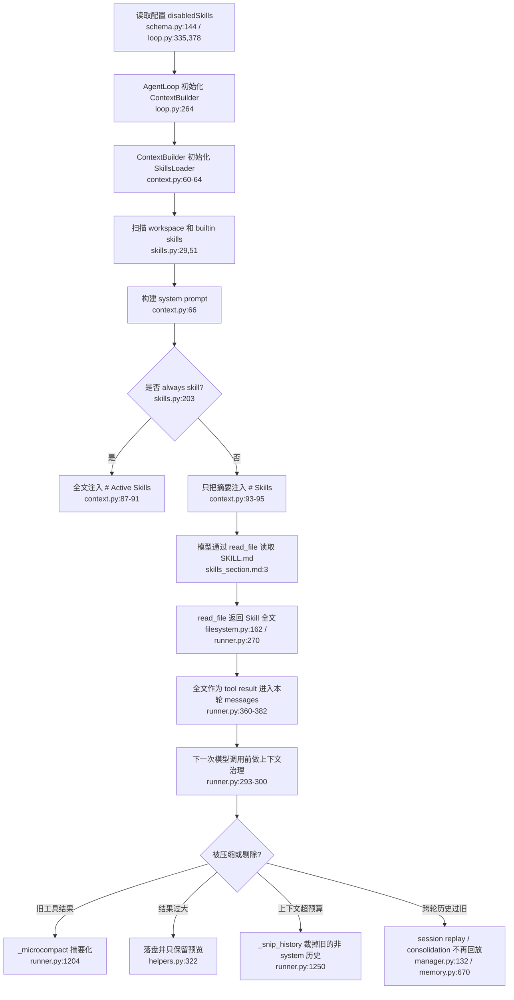
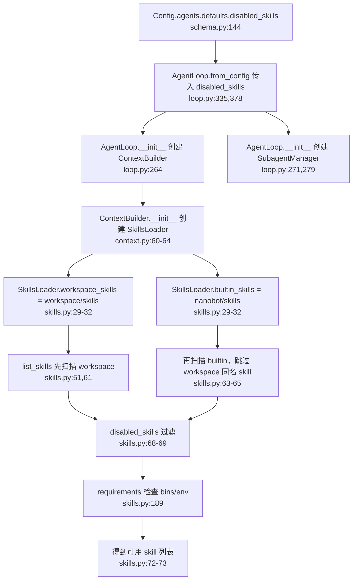
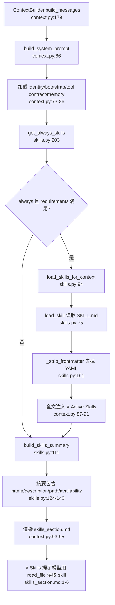
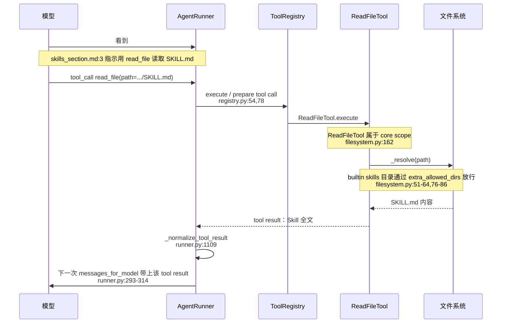
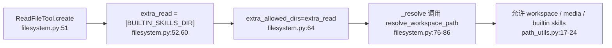
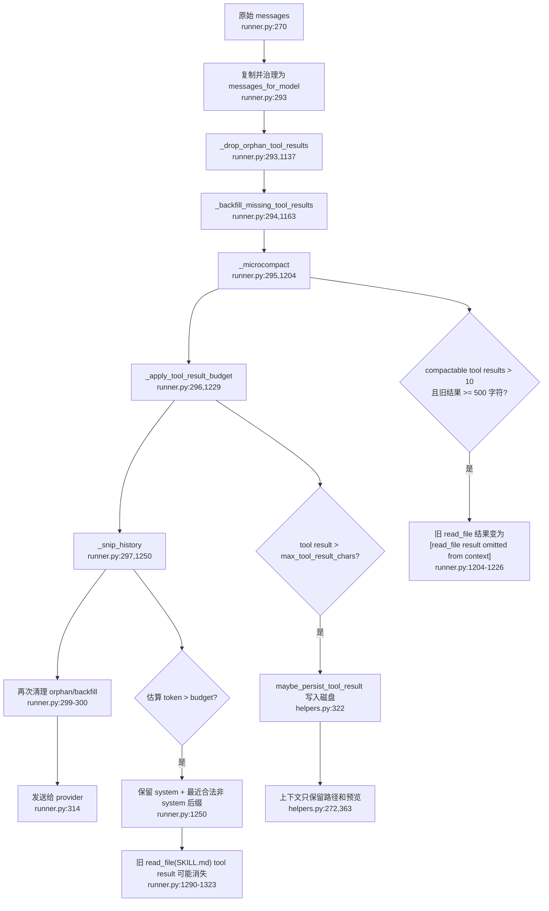
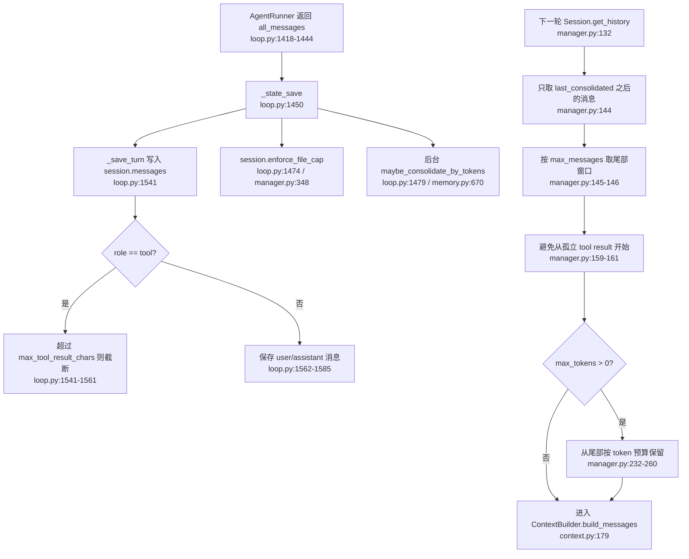
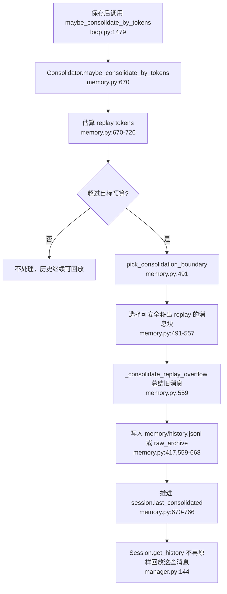
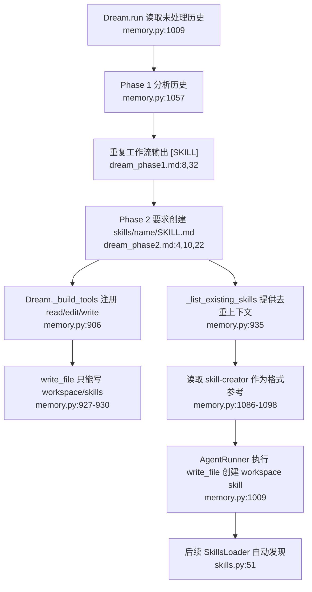
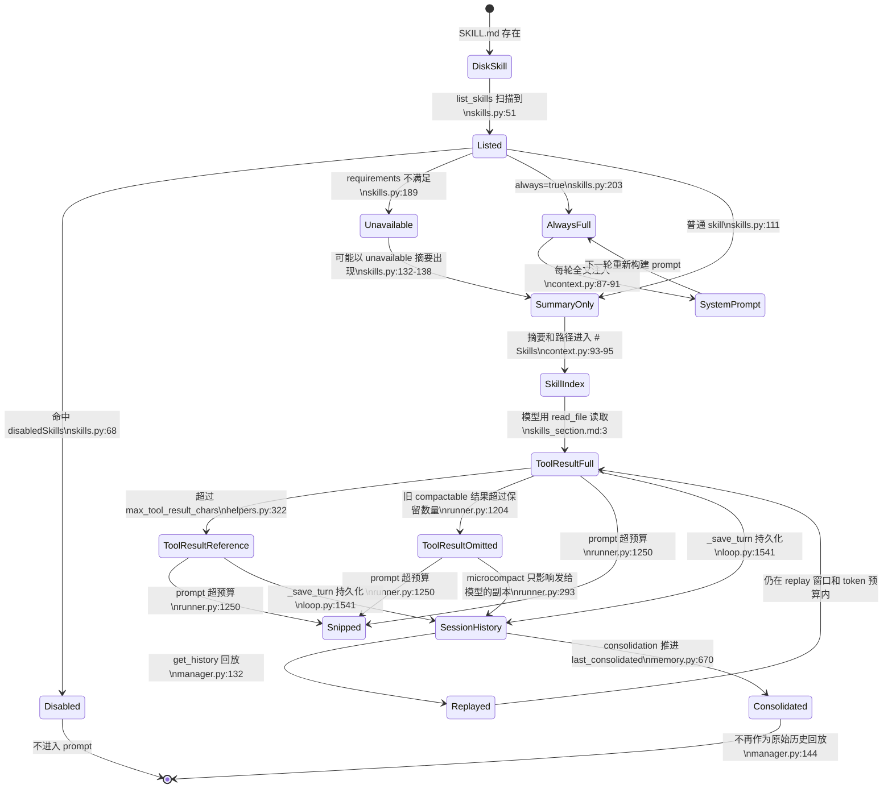

# Skill 机制说明

本文梳理 `nanobot` 的 Skill 完整生命周期，包括初始化、发现、加载、使用、从上下文中剔除、跨轮回放，以及 Dream 自动创建 Skill 的流程。

这里说的“剔除”指 **Skill 全文不再出现在下一次发给模型的 `messages_for_model` 中**，不是删除磁盘上的 `SKILL.md` 文件。

## 总览



## 初始化与发现



Skill 查找目录：

```text
<workspace>/skills/<skill-name>/SKILL.md
nanobot/skills/<skill-name>/SKILL.md
```

规则：

- workspace skill 优先级高于 builtin skill。
- 如果 workspace 和 builtin 里有同名 skill，builtin 版本会被跳过。
- `disabledSkills` 同时作用于 workspace skill、builtin skill、主 agent 和 subagent。
- 依赖检查来自 frontmatter 的 `metadata.nanobot.requires`。
- 兼容 `metadata.openclaw` 结构。

依赖声明示例：

```yaml
metadata:
  nanobot:
    requires:
      bins: ["gh"]
      env: ["GITHUB_TOKEN"]
```

## Prompt 加载策略



加载策略分两类：

```text
always skill = 每轮把全文注入 system prompt
普通 skill = 每轮只注入摘要和路径
```

普通 skill 不会因为“可用”就自动把全文塞进上下文。模型必须显式读取对应的 `SKILL.md`。

## 使用 Skill



内置 skills 不在用户 workspace 里，所以 `ReadFileTool.create()` 专门把内置 skills 目录加入额外可读目录：



## 本轮内的上下文治理

每次请求模型前，`AgentRunner` 不直接发送原始 `messages`，而是先构造并治理 `messages_for_model`：



普通 skill 全文是 `read_file` 的 tool result，因此和其他可压缩工具结果走同一套治理逻辑：

- `_microcompact()`：把较旧的可压缩工具结果摘要化。
- `_apply_tool_result_budget()`：把超大的工具结果落盘，上下文里只留引用和预览。
- `_snip_history()`：上下文超预算时，裁掉旧的非 system 历史。

`always` skill 不同。它属于 system prompt 内容，不走这些 tool-result 剔除规则。

## 保存与跨轮回放



跨轮时，普通 skill 全文只有同时满足以下条件才会再次进入上下文：

1. 对应的 `read_file` tool result 还在 `session.messages` 里。
2. 它位于 `session.last_consolidated` 之后。
3. 它还在 `max_messages` 尾部窗口内。
4. 它符合 replay token budget。
5. 它仍然有合法的 assistant tool-call 边界。

## Consolidation 与长期退出



Consolidation 不是 skill 专用机制。它处理所有旧消息，其中也包括旧的 `read_file(SKILL.md)` 工具结果。

## Dream 自动创建 Skill



Dream 创建的是 workspace skill，因此如果和 builtin skill 同名，会优先于 builtin skill。

## 状态机视角



## 关键代码索引

- Skill loader：`nanobot/agent/skills.py:21`
- Loader 初始化：`nanobot/agent/skills.py:29`
- 列出 skills：`nanobot/agent/skills.py:51`
- 读取单个 skill：`nanobot/agent/skills.py:75`
- always skills：`nanobot/agent/skills.py:203`
- system prompt 注入：`nanobot/agent/context.py:66`
- 构建 messages：`nanobot/agent/context.py:179`
- Skill prompt 模板：`nanobot/templates/agent/skills_section.md:1`
- read_file 访问 builtin skills：`nanobot/agent/tools/filesystem.py:51`
- runner 上下文治理：`nanobot/agent/runner.py:293`
- microcompact：`nanobot/agent/runner.py:1204`
- 工具结果预算：`nanobot/agent/runner.py:1229`
- 历史裁剪：`nanobot/agent/runner.py:1250`
- 超大工具结果落盘：`nanobot/utils/helpers.py:322`
- 保存 turn：`nanobot/agent/loop.py:1541`
- session replay：`nanobot/session/manager.py:132`
- consolidation：`nanobot/agent/memory.py:670`
- Dream skill 发现：`nanobot/templates/agent/dream_phase1.md:8`
- Dream skill 创建：`nanobot/templates/agent/dream_phase2.md:4`

