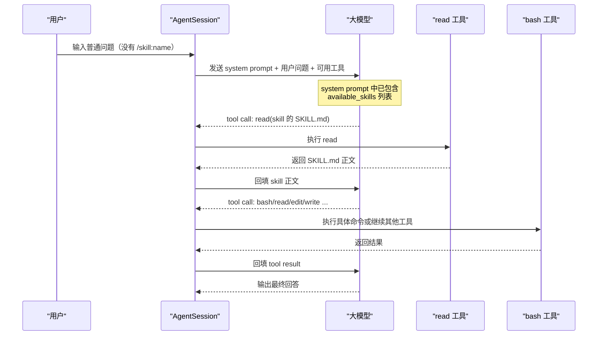
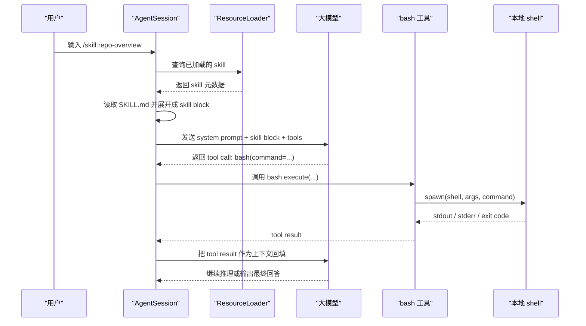
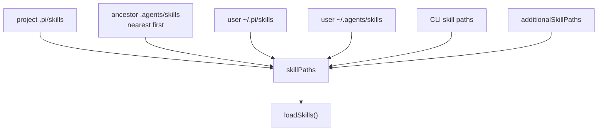

# Skills 机制详解

这篇文档从 `pi-coding-agent` 的源码出发，解释 skill 是什么、什么时候会被加载、`/skill:name` 做了什么，以及 skill 里写到的脚本命令最后是怎么执行的。

如果你已经看过 [skills.md](./skills.md)，可以把这篇文档当作它的中文源码版补充说明。

## 先看结论

在这个项目里，skill 不是一个独立的执行引擎，也不是插件运行时。

skill 的本质是一个按需加载的“指令包”：

- 启动时，系统只收集 skill 的名字、描述、位置
- 这些信息会被放进 system prompt，让模型知道“有哪些 skill 可用”
- 当模型或用户显式触发 skill 时，系统才读取对应的 `SKILL.md`
- `SKILL.md` 的正文会作为一段文本注入到消息里
- 模型读完 skill 后，自己决定是否调用 `read`、`bash`、`edit`、`write` 等工具

这套设计的重点是渐进披露：

- 常驻上下文里只放轻量元数据
- 具体说明按需读取
- 真正执行命令依旧走工具层，而不是在读取 skill 时直接执行

## Skill 在哪里被发现

skill 的发现逻辑在 `packages/coding-agent/src/core/skills.ts`。

核心入口：

- `loadSkillsFromDir()`：从单个目录递归加载 skill
- `loadSkills()`：按用户目录、项目目录、CLI 显式传入路径统一汇总

默认位置：

- 用户级：`~/.pi/agent/skills/`
- 项目级：`.pi/skills/`

源码位置：

- `packages/coding-agent/src/core/skills.ts:147`
- `packages/coding-agent/src/core/skills.ts:379`

发现规则有两个要点：

1. 如果某个目录下存在 `SKILL.md`，这个目录会被当作 skill 根目录，不再继续向下递归。
2. 如果目录根下有直接的 `.md` 文件，也会被当作 skill 加载。

这意味着 skill 既支持：

```text
my-skill/
└── SKILL.md
```

也支持：

```text
skills/
└── something.md
```

不过从现在的实现和文档看，更推荐的结构仍然是目录加 `SKILL.md`。

## Skill 文件会校验什么

在 `loadSkillFromFile()` 中，系统会解析 frontmatter，并做一组宽松校验。

源码位置：

- `packages/coding-agent/src/core/skills.ts:222`

主要校验项：

- `name`
  - 是否和父目录同名
  - 是否只包含小写字母、数字、连字符
  - 是否超过 64 个字符
- `description`
  - 是否存在
  - 是否超过 1024 个字符

有两个行为值得注意：

1. 大多数问题只会产生 warning，不会阻止 skill 加载。
2. `description` 缺失时，skill 不会被加载。

原因很直接：系统依赖 `description` 来告诉模型“什么时候该用这个 skill”。没有描述，就没有办法做匹配。

## Skill 元数据如何进入 system prompt

skill 不会在启动时把 `SKILL.md` 全文塞进 prompt。系统只会把 skill 元数据格式化成 XML，加入 system prompt。

源码位置：

- `packages/coding-agent/src/core/skills.ts:314`
- `packages/coding-agent/src/core/system-prompt.ts:200`

格式化后的结构大致是：

```xml
<available_skills>
  <skill>
    <name>repo-overview</name>
    <description>Inspect the current repository...</description>
    <location>/path/to/SKILL.md</location>
  </skill>
</available_skills>
```

在这段 XML 之前，系统还会补两句关键提示：

- 当任务匹配 skill 描述时，使用 `read` 工具加载 skill 文件
- skill 文件里出现相对路径时，按 skill 目录解析

这两句提示很重要，因为它们定义了 skill 的运行模式：

- 模型要先“知道 skill 存在”
- 需要时自己用 `read` 去读
- 读到正文后，再决定下一步调用什么工具

## Skill 怎样参与最终的 system prompt

最终 system prompt 由 `buildSystemPrompt()` 组装。

源码位置：

- `packages/coding-agent/src/core/system-prompt.ts`

它会把下面几部分拼起来：

1. 基础角色提示
2. 当前可用工具列表
3. 跟工具相关的行为约束
4. 项目上下文文件，比如 `AGENTS.md`
5. skill 元数据列表
6. 当前日期和工作目录

和 skill 直接相关的代码点是：

- `packages/coding-agent/src/core/system-prompt.ts:76`
- `packages/coding-agent/src/core/system-prompt.ts:79`
- `packages/coding-agent/src/core/system-prompt.ts:200`
- `packages/coding-agent/src/core/system-prompt.ts:202`

对应的意义是：

- 只有当前启用了 `read` 工具时，skill 列表才会追加进 prompt
- 因为 skill 的标准用法本来就依赖 `read` 去加载正文

## ResourceLoader 在这里做了什么

`ResourceLoader` 是 skill 机制真正接进运行时的桥梁。

源码位置：

- `packages/coding-agent/src/core/resource-loader.ts`

它负责统一加载这些资源：

- extensions
- skills
- prompts
- themes
- `AGENTS.md` / `CLAUDE.md`
- `SYSTEM.md` / `APPEND_SYSTEM.md`

和 skill 最相关的几个点：

- `getSkills()`：向运行时提供已经加载的 skill 列表
- `reload()`：重新扫描资源
- `updateSkillsFromPaths()`：把发现到的 skill 路径转换成最终 skill 列表

源码位置：

- `packages/coding-agent/src/core/resource-loader.ts:29`
- `packages/coding-agent/src/core/resource-loader.ts:249`
- `packages/coding-agent/src/core/resource-loader.ts:287`
- `packages/coding-agent/src/core/resource-loader.ts:447`

可以把 `ResourceLoader` 理解成一层资源目录和运行时之间的适配器：

- `skills.ts` 负责“怎么扫描和解析”
- `resource-loader.ts` 负责“把扫描结果接到 agent session 上”

## `/skill:name` 到底做了什么

很多人会直觉以为 `/skill:name` 会“执行 skill”。实际上它做的事情更简单，也更底层：它只是把 skill 文件展开成一段用户消息文本。

源码位置：

- `packages/coding-agent/src/core/agent-session.ts:1042`

具体流程：

1. 用户输入 `/skill:repo-overview`
2. `AgentSession.prompt()` 在真正发请求前，先调用 `_expandSkillCommand()`
3. 系统根据 skill 名称找到对应的 `SKILL.md`
4. 读出全文，去掉 frontmatter
5. 包成一个 `<skill ...>...</skill>` 块
6. 把这段文本当作用户消息内容发给模型

展开后的文本结构大致是：

```text
<skill name="repo-overview" location="/path/to/SKILL.md">
References are relative to /path/to/skill-dir.

...SKILL.md 正文...
</skill>
```

如果用户在命令后面继续写参数：

```text
/skill:repo-overview 重点看 coding-agent 包
```

那系统会把参数追加在 skill block 后面，一起交给模型。

对应源码：

- `packages/coding-agent/src/core/agent-session.ts:1042`
- `packages/coding-agent/src/core/agent-session.ts:1053`
- `packages/coding-agent/src/core/agent-session.ts:1055`

这一步非常关键，因为它说明：

- `/skill:name` 不是单独的执行协议
- 它本质上只是“把 skill 正文强制塞进当前这轮用户输入”

## 用户没有写 `/skill:name` 时，skill 是怎么被自主调用的

这条链路和显式 `/skill:name` 完全不同。

先说结论：这里没有一个叫“自动调用 skill”的专门执行器。系统不会在收到用户问题后，先跑一遍规则引擎去挑 skill，再自动展开。真正发生的是：

1. 运行时把“可用 skill 列表”放进 system prompt
2. 模型根据用户问题和 skill 描述，自己判断要不要用某个 skill
3. 如果决定使用，模型再调用 `read` 工具读取对应的 `SKILL.md`
4. 读到 skill 正文后，模型继续决定是否调用 `bash`、`edit`、`write` 等工具

也就是说，非显式 skill 调用的关键不是某段“自动装配代码”，而是这几样东西一起起作用：

- skill 元数据被注入到 system prompt
- system prompt 明确提示模型在匹配时去读 skill 文件
- skill 文件路径被暴露给模型
- 模型具备 `read` 工具

源码上最直接的证据在这里：

- `formatSkillsForPrompt()` 会生成这两句提示：
  - “Use the read tool to load a skill's file when the task matches its description.”
  - “When a skill file references a relative path, resolve it against the skill directory...”
- 对应位置：
  - `packages/coding-agent/src/core/skills.ts:323`
  - `packages/coding-agent/src/core/skills.ts:324`

这两句提示定义了“自主调用”的协议本身。

### 关键点：这里没有自动展开 skill 的专门代码分支

显式调用时，系统会走 `_expandSkillCommand()`，也就是：

- 找到 skill
- 读取 `SKILL.md`
- 直接把正文塞进当前用户消息

对应源码：

- `packages/coding-agent/src/core/agent-session.ts:1042`

但在非显式调用场景下，`AgentSession.prompt()` 并不会主动帮模型展开 skill。除了 `/skill:name` 这一条分支外，剩下的路径就是普通的：

- system prompt
- user message
- tools

然后交给模型自己决策。

换句话说：

- 显式 `/skill:name`：运行时先展开 skill，再发给模型
- 自主调用 skill：运行时只告诉模型“有哪些 skill”，由模型自己先调用 `read`

### 一次自主调用 skill 的典型链路

假设当前 system prompt 里已经有这样一个可用 skill：

- `repo-overview`
- 描述：适合做仓库结构和模块入口概览

用户输入：

```text
帮我先快速看一下这个仓库结构，再告诉我从哪里读起
```

此时运行时不会先把 `repo-overview` 展开，而是把这条普通用户消息和 system prompt 一起交给模型。模型看到：

- 当前任务像是在做仓库结构概览
- skill 列表里有一个 `repo-overview`
- prompt 明确要求：任务匹配时，用 `read` 去读 skill 文件

于是模型很可能先发起一个 `read` 工具调用，去读取 `repo-overview` 的 `SKILL.md`。

语义上近似于：

```json
{
  "name": "read",
  "arguments": {
    "path": "C:/Users/farben/.pi/agent/skills/repo-overview/SKILL.md"
  }
}
```

读取到 skill 正文后，模型下一步可能：

- 再去 `read README.md`
- 或调用 `bash` / `ls` 看目录结构
- 或两者都做

所以“自主调用 skill”实际上是“两段式”：

1. 先读取 skill 文件
2. 再按照 skill 指令调用其他工具

### 可以把它理解成一次普通的 tool-use 推理

非显式 skill 调用不是单独的 runtime 特性，而是普通工具调用链的一种特殊用法：

- skill 元数据是 system prompt 的一部分
- 模型把 skill 文件当作一个需要读取的参考文档
- `read` 是入口工具
- `bash`、`edit`、`write` 是执行工具

从运行时视角看，这和模型先读 `README.md` 再执行命令没有本质区别。区别只在于：

- `README.md` 是用户显式提到或模型自己想到的项目文档
- `SKILL.md` 是系统提前在 prompt 里推荐给模型的“专用工作说明书”

### Mermaid 流程图



##为什么有时模型不会自主调用 skill

这也解释了为什么文档里会特别提醒：模型“未必总会主动去读 skill 文件”。

因为这条链路依赖模型自己判断，受下面几类因素影响：

- skill 描述写得是否足够具体
- 当前用户问题是否明显匹配 skill 描述
- system prompt 里是否暴露了这个 skill
- 当前是否启用了 `read` 工具
- 模型当下是否选择直接回答，而不是先读 skill

官方文档里也明确提到这一点：

- `packages/coding-agent/docs/skills.md`

里面的表述是：

- 启动时收集 skill 名字和描述
- system prompt 提供 XML 格式的可用 skill 列表
- 当任务匹配时，agent 使用 `read` 加载 `SKILL.md`
- 但模型不一定总会这么做，所以需要通过 prompt 或 `/skill:name` 强制触发

### `disable-model-invocation` 会影响这条路径

如果某个 skill 设置了 `disable-model-invocation: true`，它会从 system prompt 的可见 skill 列表中被过滤掉。

源码位置：

- `packages/coding-agent/src/core/skills.ts:314`

具体行为是：

- 该 skill 仍然可以存在
- 仍然可以通过显式 `/skill:name` 调用
- 但不会出现在 `<available_skills>` 里
- 因而模型无法通过“看见 skill 描述并自主选择”这条路径来使用它

这说明显式调用和自主调用，在实现上确实是两条不同的入口。

### 和显式 `/skill:name` 的对比

| 场景               | skill 正文谁来加载   | 触发方式               | 是否依赖模型先判断 |
| ------------------ | -------------------- | ---------------------- | ------------------ |
| 显式 `/skill:name` | 运行时先加载         | 用户输入 slash command | 否                 |
| 自主 skill 调用    | 模型先用 `read` 加载 | 模型根据描述自行决定   | 是                 |

如果你希望某个 skill 每次都稳定触发，最直接的方式仍然是：

- 用 `/skill:name`
- 或在用户提示里非常明确地点名这个 skill 的用途

## Skill 里的脚本命令什么时候会真的执行

不会在读取 skill 时执行。

这是 skill 机制里最容易误解的一点。

假设 `SKILL.md` 里写了这样一段说明：

```
Run:

python {baseDir}/scripts/check.py
```

当系统读取这个 skill 时，它只会把这段文字发给模型。系统并不会因为看到 `bash` 代码块，就马上去执行那条命令。

真正执行命令的仍然是工具层。

这意味着流程是：

1. 系统把 skill 文本交给模型
2. 模型理解“为了完成这个 skill，我应该执行一个命令”
3. 模型显式发起一个 `bash` 工具调用
4. 运行时收到这个工具调用后，才真正执行命令

所以 skill 负责的是“教模型怎么做”，不是“替模型直接做”。

## 模型是怎么调用 `bash` 工具的

不是靠输出一段普通文本，而是通过结构化 tool call。

`bash` 工具定义在：

- `packages/coding-agent/src/core/tools/bash.ts:154`
- `packages/coding-agent/src/core/tools/bash.ts:179`

工具定义包含：

- 名字：`bash`
- 描述：在当前工作目录执行命令
- 参数 schema：
  - `command`
  - `timeout`

当模型决定执行命令时，语义上等价于返回这样一个结构：

```json
{
  "name": "bash",
  "arguments": {
    "command": "python /abs/path/to/script.py",
    "timeout": 30
  }
}
```

然后运行时才会调用 `bash` 工具对象的 `execute()`。

## `bash` 工具如何真正执行命令

本地执行是在 `createLocalBashOperations()` 里完成的。

源码位置：

- `packages/coding-agent/src/core/tools/bash.ts:57`

关键调用是：

- `spawn(shell, [...args, command], { ... })`

对应源码位置：

- `packages/coding-agent/src/core/tools/bash.ts:67`

这个实现还处理了几件运行时细节：

- 工作目录不存在时直接报错
- 支持超时
- 支持中止信号
- 同时收集 stdout 和 stderr
- 输出过大时写入临时文件，并返回截断后的摘要

真正的工具对象在这里定义：

- `packages/coding-agent/src/core/tools/bash.ts:179`

执行入口在：

- `packages/coding-agent/src/core/tools/bash.ts:183`

## 一次完整时序

下面这张图把从 skill 到脚本执行的链路串起来。



这张图里最关键的分界线是：

- skill block 之前，都是“提示模型该怎么做”
- `bash.execute()` 之后，才是真正的命令执行

## Skill 为什么要设计成这种机制

从实现上看，这种设计解决了三个问题。

### 只把必要信息放进上下文

如果每个 skill 的正文都长期驻留在 system prompt 里，上下文会很快膨胀。现在的实现只保留：

- 名字
- 描述
- 文件位置

真正的正文只在需要时读取。

### 复用现有工具体系

skill 本身不需要维护第二套执行沙箱，也不需要定义自己的脚本协议。它只是引导模型去调用已有工具：

- `read`
- `bash`
- `edit`
- `write`

这样实现更简单，也更一致。

### skill 可以带脚本，但不是脚本系统

skill 目录可以带：

- `scripts/`
- `references/`
- `assets/`

但这些文件不会自动执行。它们只是 skill 可引用的资源。是否执行、先执行什么、失败后怎么处理，仍然由模型结合工具调用来决定。

## 与 extension 的区别

如果你把 skill 和 extension 放在一起看，可以这样区分：

### Skill

- 主要是文本指令和辅助资源
- 通过 prompt 影响模型行为
- 依赖模型主动调用工具
- 适合流程、规范、辅助脚本封装

### Extension

- 是真正的 TypeScript 运行时代码
- 可以注册工具、命令、UI、事件处理器
- 不需要通过 prompt 间接表达
- 适合需要稳定控制流和可编程行为的能力

从源码上看：

- skill 机制主要在 `skills.ts`、`resource-loader.ts`、`agent-session.ts`
- extension 机制主要在 `core/extensions/`

如果某个能力需要“精确执行，不依赖模型自己判断”，通常更适合 extension，而不是 skill。

## 一个实际可记忆的心智模型

理解 skill 机制，最简单的方法是记住这一句：

> skill 是给模型看的 README，不是给运行时直接执行的插件。

对应到代码就是：

- `skills.ts`：扫描和格式化 skill
- `resource-loader.ts`：把 skill 接入会话资源
- `system-prompt.ts`：把 skill 元数据放进 prompt
- `agent-session.ts`：把 `/skill:name` 展开成正文
- `tools/bash.ts`：当模型真的发起工具调用时，才执行命令

## 相关源码索引

如果你想继续顺着代码读，可以按这个顺序看：

1. `packages/coding-agent/src/core/skills.ts`
2. `packages/coding-agent/src/core/resource-loader.ts`
3. `packages/coding-agent/src/core/system-prompt.ts`
4. `packages/coding-agent/src/core/agent-session.ts`
5. `packages/coding-agent/src/core/tools/bash.ts`

这五个文件基本覆盖了 skill 机制的主链路。

## Skill 的加载顺序与优先级

如果你把问题聚焦到“不同目录下的 skill，最终谁先生效”，答案要分成两层：

- 第一层是“哪些目录会先被加入候选列表”
- 第二层是“同名 skill 冲突时保留哪一个”

在当前实现里，这两层的规则是一致的：先进入加载链路的 skill，优先级更高。

### 自动发现的目录顺序

`ResourceLoader.reload()` 会先从 `PackageManager` 拿到自动发现的 skill 路径，再把 CLI 和运行时附加路径并进来。
对应源码：

- `packages/coding-agent/src/core/package-manager.ts:1841`
- `packages/coding-agent/src/core/package-manager.ts:1873`
- `packages/coding-agent/src/core/resource-loader.ts:395`

按最终进入 `loadSkills()` 的顺序，默认是：

1. 项目级 `.pi/skills`
2. 从当前工作目录一路向上直到 git 根的各级 `.agents/skills`
3. 用户级 `~/.pi/skills`
4. 用户级 `~/.agents/skills`
5. CLI 传入的 skill 路径
6. 运行时追加的 `additionalSkillPaths`

可以把它画成：



这里有两个细节值得注意：

- 祖先 `.agents/skills` 是从“当前目录”开始一路往上收集，所以离当前工作目录最近的那个目录会更早进入列表。对应源码在 `collectAncestorAgentsSkillDirs()`，见 `packages/coding-agent/src/core/package-manager.ts:323`
- `ResourceLoader` 组装 skill 路径时，`enabledSkills` 在前，`cliEnabledSkills` 在中间，`additionalSkillPaths` 在最后。见 `packages/coding-agent/src/core/resource-loader.ts:395`

### 同名 skill 冲突时谁生效

最终真正决定“用哪个 skill”的，是 `loadSkills()` 里的去重逻辑。
对应源码：

- `packages/coding-agent/src/core/skills.ts:390`

规则很简单：

- 如果同一个 skill 名称第一次出现，就放进 `skillMap`
- 后面再遇到同名 skill，不覆盖前面的，只记录 collision diagnostic

也就是说，当前实现是：

- 先加载到的 skill 胜出
- 后加载到的同名 skill 失效，但会留下冲突诊断

这也是为什么上面的目录顺序可以直接理解成“优先级顺序”。

例如：

- 项目里的 `.pi/skills/repo-overview/SKILL.md`
- 用户目录里的 `~/.pi/skills/repo-overview/SKILL.md`

如果它们名字都叫 `repo-overview`，项目级的会先进入加载链路，所以最终生效的是项目级版本。

### `/skill:name` 和自动调用都受这个顺序影响

这个优先级不只影响 system prompt 里的 `<available_skills>` 列表，也影响显式 `/skill:name` 的解析结果。

源码在：

- `packages/coding-agent/src/core/agent-session.ts:1049`

`/skill:name` 的实现是：

- 从 `resourceLoader.getSkills().skills`
- 用 `find((s) => s.name === skillName)` 取第一个同名项

因此只要前面已经因为加载顺序把某个同名 skill 放在更前面，`/skill:name` 也会优先命中它。

### 单个目录内部没有显式排序

还有一个容易误判的点：单个 skills 目录内部的扫描顺序，并没有额外做排序。

对应源码：

- `packages/coding-agent/src/core/skills.ts:171`
- `packages/coding-agent/src/core/package-manager.ts:265`

这两处都是直接 `readdirSync(..., { withFileTypes: true })` 后顺序遍历，没有再调用 `sort()`。
这意味着：

- 当前实现不保证严格按字母序加载
- 目录内的先后顺序本质上依赖文件系统返回顺序
- 如果你需要稳定优先级，不应该依赖“同一个目录里两个文件谁排前面”，而应该避免同名 skill，或者把更高优先级的 skill 放到更高优先级的目录来源里

### `--no-skills` 是一个例外

如果启用了 `noSkills`，默认自动发现的项目级和用户级 skill 会被跳过。
此时保留下来的主要是：

- CLI 传入的 skill 路径
- `additionalSkillPaths`

对应源码：

- `packages/coding-agent/src/core/resource-loader.ts:395`

所以 `--no-skills` 不是“禁掉所有 skill”，而是“禁掉默认发现的 skill，只保留显式追加的 skill 来源”。
